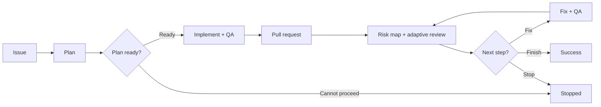

# pr-loop

> GitHub-native, race-safe Agentic Issue-Driven Development orchestrator.

`pr-loop` turns GitHub Issues into reviewed pull requests and drives existing pull requests through review, fixes, and re-review until no actionable feedback or reviewer-blocked state remains.

It uses a single-writer multi-agent model: fresh native subagents plan, review, and analyze feedback, while the top-level agent alone mutates the repository and GitHub state.

## How it works



For an existing pull request, the loop starts at review.

Reviews are selected adaptively from the change and risk map rather than using a fixed reviewer set. Unscoped reviews retain baseline correctness, regression, tests, and documentation coverage, while security, performance, errors, types, comments, compatibility, and KISS/DRY/YAGNI simplification lenses are added only when the PR justifies them. Explicitly scoped reviews honor the caller's requested aspects as a hard constraint. Reviewer tasks are scoped around concrete risks, and Codex installations can route each task to Luna, Terra, or Sol according to its difficulty and risk.

Feedback is classified into concrete dispositions such as `fix`, `already addressed`, `outdated`, `answer`, `clarify`, `defer`, or `won't fix`.

## Race-safety

- **Single writer:** only the top-level agent edits, commits, pushes, publishes reviews, replies, or resolves threads.
- **Exact-head review:** every review and feedback decision is bound to one PR head SHA; stale results are discarded when the head moves.
- **Stable feedback:** feedback is snapshotted and re-analyzed when external comments, reviews, or threads change.
- **Fresh advisors:** planning, review, and feedback analysis run in independent read-only subagents with fresh context.
- **Fail closed:** the loop stops on ambiguous state, unsafe worktrees, unavailable required subagents, failed QA, or unresolved blocking reviewer state.

Success requires the final exact head to have a verified review, reconciled feedback, and no actionable or reviewer-blocked item remaining.

## Agent routing

For each advisory role, `pr-loop` prefers a matching user-defined native agent, then a suitable built-in agent. If the runtime cannot provide an independent bounded subagent, the workflow stops rather than silently running the role in the main context.

## Requirements

- Git and authenticated GitHub access through `gh` or an equivalent integration.
- A coding-agent runtime with native independent subagents and finite dispatch bounds.

## Usage

```text
Implement https://github.com/OWNER/REPO/issues/123 with pr-loop
Run pr-loop on https://github.com/OWNER/REPO/pull/456
```

See [`skills/pr-loop/SKILL.md`](skills/pr-loop/SKILL.md) for the normative workflow and invariants.

## Background

`pr-loop` is a native-subagent rewrite of the former [`oracle-pr-loop`](https://github.com/dceoy/oracle-pr-loop) workflow, without Oracle, browser automation, fixed-model, or coding-agent CLI dependencies.
