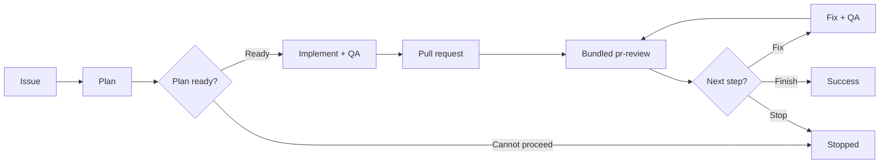

# pr-loop

> GitHub-native, race-safe Agentic Issue-Driven Development orchestrator.

`pr-loop` turns GitHub Issues into reviewed pull requests and drives existing pull requests through review, fixes, and re-review until no actionable feedback or reviewer-blocked state remains.

It uses a single-writer multi-agent model: fresh native subagents plan, review, and analyze feedback, while the top-level agent alone mutates the repository and GitHub state.

## How it works



For an existing pull request, the loop starts at review.

The review phase is provided by the bundled [`pr-review`](skills/pr-review/SKILL.md) skill. `pr-loop` executes that procedure in the same top-level agent context rather than launching it as a nested subagent, so review discovery and independent validation remain direct fresh read-only leaves while the single-writer boundary stays intact. The bundled skill can also be used standalone.

When composed by `pr-loop`, `pr-review` completes one frozen-head review and publishes it explicitly against that exact commit even if the live PR head advances. After it returns, `pr-loop` re-checks the live head; when it changed, the historical review remains posted and `pr-loop` immediately runs `pr-review` again for the new head before feedback analysis or fixes. Standalone `pr-review` prefers the same commit-bound publication, but when the runtime cannot target historical commits it may safely fall back to current-head publication only after confirming the live head still equals the frozen snapshot; otherwise it restarts on the new head.

Reviews are selected adaptively from the change and risk map rather than using a fixed reviewer set. Unscoped reviews retain baseline correctness, regression, tests, and documentation coverage, while conditional lenses are added only when the PR justifies them. Candidate findings are independently validated before publication, and explicit review scopes remain hard constraints.

Feedback is classified into concrete dispositions such as `fix`, `already addressed`, `outdated`, `answer`, `clarify`, `defer`, or `won't fix`.

## Race-safety

- **Single writer:** only the top-level agent edits, commits, pushes, publishes reviews, replies, or resolves threads.
- **Frozen-head review:** each `pr-loop` review is published for exactly one frozen head SHA; a live-head change triggers another review instead of cancelling the completed historical review.
- **Fresh-state actions:** feedback analysis, fixes, replies, and thread resolution proceed only while the live head still matches the reviewed SHA.
- **Stable feedback:** feedback is snapshotted and re-analyzed when external comments, reviews, or threads change.
- **Fresh advisors:** planning, review discovery/validation, and feedback analysis run in independent read-only subagents with fresh context.
- **Fail closed:** the loop stops on ambiguous state, unsafe worktrees, unavailable required subagents, failed QA, or unresolved blocking reviewer state.

Success requires the final exact head to have a verified review, reconciled feedback, and no actionable or reviewer-blocked item remaining.

## Agent routing

For each advisory role, `pr-loop` prefers a matching user-defined native agent, then a suitable built-in agent. If the runtime cannot provide an independent bounded subagent, the workflow stops rather than silently running the role in the main context.

## Requirements

- Git and authenticated GitHub access through `gh` or an equivalent integration.
- A coding-agent runtime with native independent subagents and finite dispatch bounds.

## Usage

```text
Implement https://github.com/OWNER/REPO/issues/123 with pr-loop
Run pr-loop on https://github.com/OWNER/REPO/pull/456
Review https://github.com/OWNER/REPO/pull/456 with pr-review
```

See [`skills/pr-loop/SKILL.md`](skills/pr-loop/SKILL.md) for orchestration and [`skills/pr-review/SKILL.md`](skills/pr-review/SKILL.md) for the review procedure.

## Background

`pr-loop` is a native-subagent rewrite of the former [`oracle-pr-loop`](https://github.com/dceoy/oracle-pr-loop) workflow, without Oracle, browser automation, fixed-model, or coding-agent CLI dependencies.
