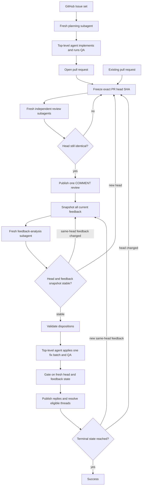

# pr-loop

> GitHub-native, race-safe Agentic Issue-Driven Development orchestrator.

`pr-loop` drives GitHub Issues and pull requests through implementation, independent review, feedback reconciliation, fixes, and re-review until the exact current PR head is clean.

It is designed as a single-writer multi-agent state machine: fresh native subagents plan, review, and analyze feedback, while the top-level agent alone mutates the repository and GitHub state.

## Why pr-loop

Agentic development becomes unreliable when multiple agents edit the same checkout, reviews are applied to moving PR heads, or feedback changes while fixes are being prepared. `pr-loop` treats those conditions as concurrency problems rather than prompt-engineering problems.

Its core model is:

- **GitHub-native:** Issues, PR heads, reviews, comments, and review threads are the workflow state and source of truth.
- **Agentic Issue-Driven Development:** Issues define the implementation intent; independent agents provide planning, review, and feedback analysis around one mutation-owning implementation agent.
- **Race-safe:** every review and feedback decision is bound to an exact PR head SHA, stale results are discarded, and feedback is reconciled against a stable snapshot before mutation.
- **Single-writer:** only the top-level agent edits files, commits, pushes, opens or updates PRs, publishes reviews, replies, and resolves threads.
- **Convergent:** the loop finishes only when the final head has been reviewed, feedback is reconciled, and no actionable or reviewer-blocked item remains.

## Workflow



### Issue-started work

1. Resolve one or more Issues from the same repository.
2. Ask one fresh read-only planning subagent for a decision-complete implementation plan.
3. Bind a clean worktree to the intended base SHA.
4. Implement and run QA in the top-level agent.
5. Commit, push, and open the PR.
6. Enter the PR review loop.

### Existing pull request

1. Freeze the exact current PR head SHA.
2. Review that head with three fresh independent lenses:
   - correctness;
   - tests/docs;
   - security/performance.
3. Publish exactly one verified `COMMENT` review for that head.
4. Snapshot every current feedback source and analyze it with a fresh read-only subagent.
5. Reconcile feedback until the same-head snapshot is stable.
6. Apply validated fixes as one coherent batch, run QA, and push once.
7. Re-check the exact head and feedback state before replying or resolving threads.
8. Re-review a new head, or refresh feedback analysis when only same-head feedback changed.

## Race-safety model

`pr-loop` uses explicit optimistic-concurrency gates around GitHub state:

| Risk | Control |
| --- | --- |
| A PR changes while reviewers are working | Bind review to an exact head SHA and discard the round if the head moves |
| A fix is prepared from stale feedback | Snapshot feedback and refresh analysis whenever external feedback changes |
| A reply or thread resolution races with a push | Require the current head to equal the expected head exactly before publication |
| Multiple agents mutate one checkout | Keep all repository and GitHub mutations in the top-level agent |
| A reviewer mutates the checkout unexpectedly | Reject its output and permit recovery only when the exact prior Git state can be proven and restored |
| Old `CHANGES_REQUESTED` state is mistaken for cleared feedback | Track active reviewer state independently from item-level dispositions |

A descendant commit is not considered equivalent to the reviewed head. Decisions are valid only for the exact SHA and feedback snapshot they were derived from.

## Agent model

For advisory phases, `pr-loop` uses the active runtime's native independent-subagent mechanism:

1. Prefer an eligible user-defined agent whose declared purpose matches the role.
2. Otherwise use a suitable built-in agent.
3. If the runtime cannot launch an independent bounded subagent, stop instead of silently performing the advisory work in the main context.

Subagents are read-only terminal leaves. They do not re-enter `pr-loop`, launch nested coding-agent CLIs, publish GitHub mutations, or delegate their role again.

The repository includes `.codex` and `.claude` configuration synchronized from `dceoy/ai-coding-agent-skills`. Codex therefore has project definitions for `planner`, `reviewer`, `feedback-analyst`, and `advisor`; compatible user-defined roles are preferred before built-in fallbacks.

## Completion semantics

`pr-loop` does not equate "no new findings" with completion. Success requires all of the following on the final head:

- the exact head is stable;
- the required `COMMENT` review was verified as published for that head;
- the feedback snapshot is reconciled;
- no fix remains unpublished;
- no clarification or non-terminal defer/won't-fix item remains open;
- no active unsuperseded `CHANGES_REQUESTED` review remains;
- no failed GitHub action, QA failure, permission failure, or unsafe worktree state blocks progress.

The loop stops rather than hiding ambiguity when these conditions cannot be established.

## Requirements

- Git and authenticated GitHub access through `gh` or an equivalent integration.
- A coding-agent runtime with a native independent-subagent mechanism and finite dispatch bounds.

## Discovery

- Codex-compatible agent runtimes discover the skill at `.agents/skills/pr-loop`, a symlink to `../../skills/pr-loop`.
- Claude Code uses `.claude/skills -> ../skills`, exposing the canonical `skills/pr-loop` directory.

## Usage

Ask the host agent to implement one or more same-repository GitHub Issues through a reviewed pull request, or to review and fix an existing pull request until it reaches the terminal clean state.

Examples:

```text
Implement https://github.com/OWNER/REPO/issues/123 with pr-loop
```

```text
Run pr-loop on https://github.com/OWNER/REPO/pull/456
```

See [`skills/pr-loop/SKILL.md`](skills/pr-loop/SKILL.md) for the normative workflow and invariants.

## Background

`pr-loop` is a native-subagent rewrite of the former `oracle-pr-loop` workflow. It has no Oracle, browser automation, ChatGPT GitHub-app, fixed-model, or coding-agent CLI dependency.
