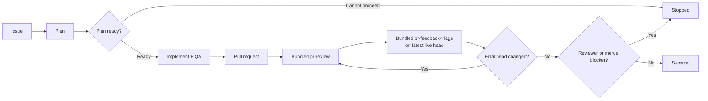

# pr-loop

> GitHub-native, race-safe Agentic Issue-Driven Development orchestrator.

`pr-loop` turns GitHub Issues into reviewed pull requests and drives existing pull requests through review, live-head feedback triage, fixes, and re-review until the final head is reviewed and no actionable or reviewer-blocked state remains.

It uses a single-writer multi-agent model: fresh native subagents plan, review, and analyze feedback, while the top-level agent alone mutates the repository and GitHub state.

## How it works



For an existing pull request, the loop starts at review.

The review phase is provided by the bundled [`pr-review`](skills/pr-review/SKILL.md) skill. `pr-loop` executes that procedure in the same top-level agent context rather than launching it as a nested subagent, so review discovery and independent validation remain direct fresh read-only leaves while the single-writer boundary stays intact.

Feedback handling is provided by the bundled [`pr-feedback-triage`](skills/pr-feedback-triage/SKILL.md) skill, copied from `dceoy/ai-coding-agent-skills`. It is also executed in the top-level context and owns feedback analysis, focused fixes, QA, commit/push, replies, resolutions, and reconciliation.

`pr-review` completes one frozen-head review and publishes it explicitly against that exact commit even if the live PR head advances. After it returns, `pr-loop` does not force another review before feedback handling: `pr-feedback-triage` starts from the latest live head and follows further head or feedback changes until triage completes. If triage finishes on a head different from the reviewed SHA, `pr-loop` starts another review round on that final head. This guarantees that the final head is reviewed before success without interrupting live-head triage.

Reviews are selected adaptively from the change and risk map rather than using a fixed reviewer set. Candidate findings are independently validated before publication. Feedback is classified into concrete dispositions such as `fix`, `already addressed`, `outdated`, `answer`, `clarify`, `defer`, or `won't fix`.

## Race-safety

- **Single writer:** only the top-level agent edits, commits, pushes, publishes reviews, replies, or resolves threads.
- **Frozen-head review:** each review is published for exactly one frozen head SHA and remains valid historical feedback if the head later advances.
- **Live-head triage:** feedback triage follows the latest live head without requiring an intervening review and discards stale prepared work whenever head or feedback state changes.
- **Safe publication:** fix batches use an isolated worktree rooted at the analyzed head, exact head+feedback gates before mutation and push, and non-force publication.
- **Final-head review:** when triage changes the head, the resulting stable head starts the next review round before success.
- **Fresh advisors:** planning, review discovery/validation, and feedback analysis run in independent read-only subagents with fresh context.
- **Fail closed:** the loop stops on ambiguous state, unsafe worktrees, unavailable required subagents, failed QA/publication, or unresolved reviewer/merge blockers.

Success requires the stable live head to equal the latest verified reviewed head, bundled feedback triage to have completed for that state, and no parent-level blocker such as `awaiting_re_review` to remain.

## Agent routing

For each advisory role, `pr-loop` prefers a matching user-defined native agent, then a suitable built-in agent. If the runtime cannot provide an independent bounded subagent, the workflow stops rather than silently running the role in the main context.

## Requirements

- Git and authenticated GitHub access through `gh` or an equivalent integration.
- A coding-agent runtime with native independent subagents and finite dispatch bounds.

## Usage

```text
Implement https://github.com/OWNER/REPO/issues/123 with pr-loop
Run pr-loop on https://github.com/OWNER/REPO/pull/456
Review https://github.com/OWNER/REPO/pull/456 with pr-review
Triage https://github.com/OWNER/REPO/pull/456 with pr-feedback-triage
```

See [`skills/pr-loop/SKILL.md`](skills/pr-loop/SKILL.md) for orchestration, [`skills/pr-review/SKILL.md`](skills/pr-review/SKILL.md) for review, and [`skills/pr-feedback-triage/SKILL.md`](skills/pr-feedback-triage/SKILL.md) for live-head feedback handling.

## Background

`pr-loop` is a native-subagent rewrite of the former [`oracle-pr-loop`](https://github.com/dceoy/oracle-pr-loop) workflow, without Oracle, browser automation, fixed-model, or coding-agent CLI dependencies.
