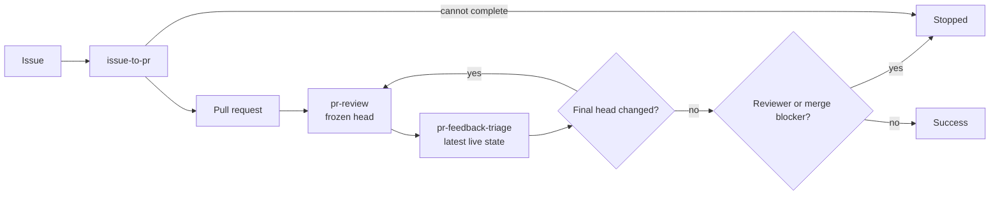

# pr-loop

> GitHub-native, race-safe Agentic Issue-Driven Development skills.

`pr-loop` provides four portable skills that can be used independently, with `pr-loop` composing the other three into an end-to-end Issue/PR loop.

- [`issue-to-pr`](skills/issue-to-pr/SKILL.md): implement same-repository Issues and stop after creating and verifying the PR.
- [`pr-review`](skills/pr-review/SKILL.md): review one frozen PR head with adaptive independent analysis and verified `COMMENT` publication.
- [`pr-feedback-triage`](skills/pr-feedback-triage/SKILL.md): reconcile feedback against the latest live head, apply focused fixes, and finish replies/resolutions.
- [`pr-loop`](skills/pr-loop/SKILL.md): compose those phases until the stable final head is reviewed, triaged, and unblocked.

Each standalone skill owns its own mechanics and result contract. The composite skill invokes the same procedures in one top-level context rather than duplicating or delegating their policies.

## Flow



For an existing pull request, `pr-loop` starts at `pr-review`.

## Core guarantees

- Single writer: repository and GitHub mutations remain owned by the top-level agent; delegated analysis is read-only.
- Exact implementation base: `issue-to-pr` binds implementation to an exact base and creates a fresh verified PR branch.
- Frozen-head review: `pr-review` analyzes one immutable snapshot and, when composed, publishes explicitly against that reviewed SHA.
- Live-head triage: `pr-feedback-triage` follows current head/feedback changes and rejects stale prepared actions before mutation.
- Final-head review: if triage changes the head, `pr-loop` starts another review round before success.
- Fail closed: unsupported isolation, unsafe repository state, unresolved QA/publication failures, stale state, exhausted caller limits, or reviewer/merge blockers stop the relevant procedure.

## Requirements

- Git and authenticated GitHub access through `gh` or an equivalent integration.
- A coding-agent runtime with native independent read-only subagents and finite dispatch bounds for phases that require advisory work.

## Usage

```text
Implement https://github.com/OWNER/REPO/issues/123 with issue-to-pr
Implement https://github.com/OWNER/REPO/issues/123 with pr-loop
Run pr-loop on https://github.com/OWNER/REPO/pull/456
Review https://github.com/OWNER/REPO/pull/456 with pr-review
Triage https://github.com/OWNER/REPO/pull/456 with pr-feedback-triage
```

See each linked `SKILL.md` for its standalone contract and `skills/pr-loop/SKILL.md` for composite orchestration.

## Background

`pr-loop` is a native-subagent rewrite of the former [`oracle-pr-loop`](https://github.com/dceoy/oracle-pr-loop) workflow without Oracle, browser automation, fixed-model, or nested coding-agent CLI dependencies.
