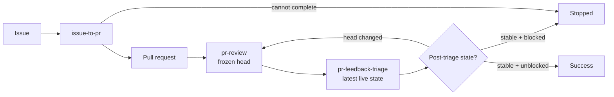

# pr-loop

> GitHub-native, race-safe Agentic Issue-Driven Development skills.

`pr-loop` provides four portable skills that can be used independently, with `pr-loop` composing the other three into an end-to-end Issue/PR loop.

- [`issue-to-pr`](skills/issue-to-pr/SKILL.md): implement same-repository Issues and stop after creating and verifying the PR.
- [`pr-review`](skills/pr-review/SKILL.md): review one frozen PR head with adaptive risk-driven analysis and verified `COMMENT` publication.
- [`pr-feedback-triage`](skills/pr-feedback-triage/SKILL.md): reconcile feedback against the latest live head, apply focused fixes, and finish replies/resolutions.
- [`pr-loop`](skills/pr-loop/SKILL.md): compose those phases until the stable final head is reviewed, triaged, and unblocked.

Each standalone skill owns its own mechanics and result contract. The composite skill reuses those procedures without duplicating their policies.

## Flow


```mermaid
flowchart LR
  I[Issue] --> P[issue-to-pr] --> PR[Pull request]
  PR --> R[pr-review<br/>frozen head]
  R --> F[pr-feedback-triage<br/>latest live state]
  F --> D{Post-triage state?}
  D -->|head changed| R
  D -->|stable + blocked| X[Stopped]
  D -->|stable + unblocked| S[Success]
  P -->|cannot complete| X
```

For an existing pull request, `pr-loop` starts at `pr-review`.

## Core guarantees

- Single writer: at most one repository writer is active during a mutation phase, and GitHub mutations are serialized against validated state.
- Exact implementation base: `issue-to-pr` binds implementation to an exact base and creates a fresh verified PR branch.
- Frozen-head review: `pr-review` analyzes one immutable snapshot and, when composed, publishes explicitly against that reviewed SHA.
- Live-head triage: `pr-feedback-triage` follows current head/feedback changes and rejects stale prepared actions before mutation.
- Final-head review: if triage changes the head, `pr-loop` starts another review round before success.
- Fail closed: unsafe repository state, unresolved QA/publication failures, stale state, exhausted caller limits, missing mandatory capabilities, or reviewer/merge blockers stop the relevant procedure.

## Requirements

- Git and authenticated GitHub access through `gh` or an equivalent integration.
- A coding-agent runtime with GitHub/repository access and finite loop bounds. `pr-loop` defaults to 3 review rounds, while `pr-feedback-triage` defaults to 9 triage restarts when callers do not specify overrides.

## Reusable workflow

Claude Code PR reviews can use the bundled reusable workflow:

```yaml
jobs:
  claude-code-review:
    permissions:
      contents: read
      pull-requests: write
      id-token: write
      actions: read
    uses: dceoy/pr-loop/.github/workflows/claude-code-review.yml@main
    secrets:
      CLAUDE_CODE_OAUTH_TOKEN: ${{ secrets.CLAUDE_CODE_OAUTH_TOKEN }}
      GH_TOKEN: ${{ secrets.GITHUB_TOKEN }}
```

The workflow invokes the bundled `pr-review` once and lets that skill own the
full review lifecycle. `pr-review` can augment its normal review with a
runtime-native first-party security pass: Claude Code's built-in
`security-review`, or OpenAI Codex Security's `Security Diff Scan` when the
Codex Security plugin is available in Codex/ChatGPT. Security results are
read-only supplemental candidates that `pr-review` revalidates and deduplicates
before publishing exactly one verified COMMENT review.

The bundled Claude Code workflow expects its built-in `security-review` to run
and verifies the nested Skill invocation from the execution transcript. In
other runtimes, if no supported first-party security capability is advertised,
the normal `pr-review` analysis continues without security augmentation.

## Usage

```text
Implement https://github.com/OWNER/REPO/issues/123 with issue-to-pr
Implement https://github.com/OWNER/REPO/issues/123 with pr-loop
Run pr-loop on https://github.com/OWNER/REPO/pull/456  # review/triage bounds are optional
Review https://github.com/OWNER/REPO/pull/456 with pr-review
Triage https://github.com/OWNER/REPO/pull/456 with pr-feedback-triage
```

See each linked `SKILL.md` for its standalone contract and `skills/pr-loop/SKILL.md` for composite orchestration.

## Background

`pr-loop` is an agent-native rewrite of the former [`oracle-pr-loop`](https://github.com/dceoy/oracle-pr-loop) workflow without Oracle, browser automation, fixed-model, or nested coding-agent CLI dependencies.
