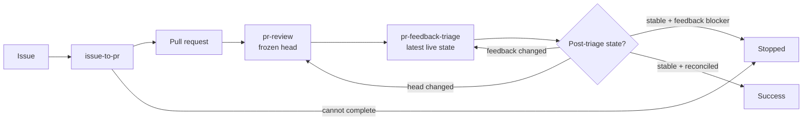

# pr-loop

> GitHub-native, race-safe Agentic Issue-Driven Development skills.

`pr-loop` provides four portable skills that can be used independently, with `pr-loop` composing the other three into an end-to-end Issue/PR loop.

- [`issue-to-pr`](skills/issue-to-pr/SKILL.md): implement same-repository Issues and stop after creating and verifying the PR.
- [`pr-review`](skills/pr-review/SKILL.md): review one frozen PR head with adaptive risk-driven analysis and verified `COMMENT` publication.
- [`pr-feedback-triage`](skills/pr-feedback-triage/SKILL.md): reconcile feedback against the latest live head, apply focused fixes, and finish replies/resolutions.
- [`pr-loop`](skills/pr-loop/SKILL.md): compose those phases until the stable final head is reviewed and published feedback is reconciled.

Each standalone skill owns its own mechanics and result contract. The composite skill reuses those procedures without duplicating their policies.

## Flow


```mermaid
flowchart LR
  I[Issue] --> P[issue-to-pr] --> PR[Pull request]
  PR --> R[pr-review<br/>frozen head]
  R --> F[pr-feedback-triage<br/>latest live state]
  F --> D{Post-triage state?}
  D -->|head changed| R
  D -->|feedback changed| F
  D -->|stable + feedback blocker| X[Stopped]
  D -->|stable + reconciled| S[Success]
  P -->|cannot complete| X
```

For an existing pull request, `pr-loop` starts at `pr-review`.

## Core guarantees

- Single writer: at most one repository writer is active during a mutation phase, and GitHub mutations are serialized against validated state.
- Exact implementation base: `issue-to-pr` binds implementation to an exact base and creates a fresh verified PR branch.
- Frozen-head review: `pr-review` analyzes one immutable snapshot and, when composed, publishes explicitly against that reviewed SHA.
- Live-head triage: `pr-feedback-triage` follows current head/feedback changes and rejects stale prepared actions before mutation.
- Final-head review: if triage changes the head, `pr-loop` starts another review round before success.
- Fail closed: unsafe repository state, unresolved required QA/publication failures, stale state, exhausted caller limits, missing mandatory capabilities, unresolved actionable feedback, or active `CHANGES_REQUESTED` reviews stop the relevant procedure.
- No third-party wait: triage published bot/human feedback, but never await pending or running third-party reviews or future comments.
- Completion is not merge readiness: CI failures, branch protection, and deployment/acceptance checks are reported separately; no protections are bypassed and no merge is implied.

## Requirements

- Git and authenticated GitHub access through `gh` or an equivalent integration.
- A coding-agent runtime with GitHub/repository access and finite loop bounds. `pr-loop` defaults to 3 review rounds, while `pr-feedback-triage` defaults to 9 triage restarts when callers do not specify overrides.

## Reusable workflow

Claude Code PR reviews can use the bundled reusable workflow:

```yaml
jobs:
  claude-code-review:
    permissions:
      contents: read
      pull-requests: write
      id-token: write
      actions: read
    uses: dceoy/pr-loop/.github/workflows/claude-code-review.yml@main
    secrets:
      CLAUDE_CODE_OAUTH_TOKEN: ${{ secrets.CLAUDE_CODE_OAUTH_TOKEN }}
      GH_TOKEN: ${{ secrets.GITHUB_TOKEN }}
```

The reusable workflow runs a **single Claude Code Action**, invoking the pinned
`pr-review` skill once for a frozen pull request head. `pr-review` looks for an
already available security-review skill, either built-in or third-party. It may
invoke one compatible skill as optional supplemental discovery, then validates
and deduplicates any findings before publishing a single verified GitHub
`COMMENT` review.

If no suitable security-review skill is available, or the runtime cannot invoke
one, `pr-review` continues on its own (including its normal security review
lens). It does not install additional security skills or represent a skipped
scan as completed. When an invoked scan fails, `pr-review` follows its
fail-closed contract instead of silently treating the result as clean.

The workflow keeps broad caller-configured Claude Code permissions and relies
on the selected skill to honor the review-only instructions; it does **not**
enforce a separate read-only security sandbox. A bounded Stop hook discourages
premature completion, while a subsequent GitHub API check independently
requires exactly one new `COMMENT` review for the frozen head. This does not
guarantee a security skill is present or that subagent completion will succeed.

## Usage

```text
Implement https://github.com/OWNER/REPO/issues/123 with issue-to-pr
Implement https://github.com/OWNER/REPO/issues/123 with pr-loop
Run pr-loop on https://github.com/OWNER/REPO/pull/456  # review/triage bounds are optional
Review https://github.com/OWNER/REPO/pull/456 with pr-review
Triage https://github.com/OWNER/REPO/pull/456 with pr-feedback-triage
```

See each linked `SKILL.md` for its standalone contract and `skills/pr-loop/SKILL.md` for composite orchestration.

## Background

`pr-loop` is an agent-native rewrite of the former [`oracle-pr-loop`](https://github.com/dceoy/oracle-pr-loop) workflow without Oracle, browser automation, fixed-model, or nested coding-agent CLI dependencies.
