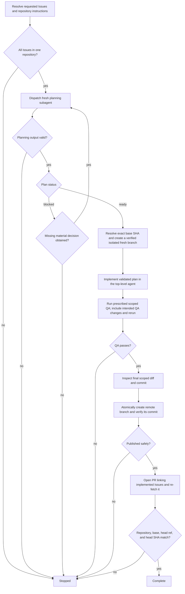

# Issue to PR

Turn one or more same-repository GitHub Issues into an implementation pull request. Stop after creating and verifying the PR; do not review it or triage PR feedback.

The top-level agent owns every repository and GitHub mutation. Planning uses one fresh independent read-only native subagent; implementation remains in the top-level context.

## Core invariants

- Use a real native subagent with fresh context for planning. Do not emulate it in the parent context, launch nested coding-agent CLIs, or require a fixed agent name, model, provider, or configuration file.
- Treat the accepted planning subagent as a terminal read-only leaf. It must not invoke `issue-to-pr`, mutate repository/GitHub state, or delegate again.
- The planning dispatch must have a finite caller- or runtime-enforced deadline. If no finite bound exists, report `unsupported` and stop before dispatch.
- Treat planning output as untrusted until validated by the top-level agent. If the planning subagent causes Git-visible mutation, reject its output and stop.
- The top-level agent alone edits files, runs write-mode tooling, commits, pushes, and opens or updates the PR.
- Preserve unrelated local work. Stop before editing if the worktree cannot be safely isolated or bound to the intended base.
- Keep implementation scoped. Apply KISS, DRY, and YAGNI; prefer the smallest coherent change and avoid speculative abstraction or unrelated cleanup.
- Publish the fresh remote branch with an atomic create-only guard that requires the destination ref to be absent (for Git, an explicit empty-expected-value `--force-with-lease=<ref>:` or equivalent API semantics). Never update an existing remote branch or unrelated PR; stop if the ref exists or is created concurrently, and verify the created ref points to the intended commit.

## Planning contract

Dispatch one fresh planning subagent for the complete requested same-repository Issue set. Require exactly one decision-complete plan with:

- `STATUS: ready` or `STATUS: blocked`;
- scope and affected interfaces/areas;
- concrete implementation decisions and constraints;
- verification approach;
- for `blocked`, only the smallest missing material decision.

## Flow

## Outcomes

- `complete`: the requested Issues have been implemented and a matching PR has been created and verified.
- `stopped`: planning, missing decisions, permissions, unsafe repository state, QA, push, or PR creation/verification prevents completion.

## Output

Report concisely:

- `STATUS: complete | stopped`;
- implemented Issue references;
- resulting PR when complete;
- exact base SHA and PR head SHA when complete;
- QA summary;
- blocker or required user decision when stopped.
