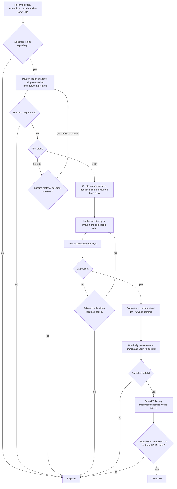

# Issue to PR

Turn one or more same-repository GitHub Issues into an implementation pull request. Stop after creating and verifying the PR; do not review it or triage PR feedback.

An orchestrator coordinates the procedure and owns commit, push, PR creation, and final state validation. Planning follows applicable project/runtime routing: the orchestrator may plan directly or use one compatible fresh independent read-only native subagent. Implementation may run in the orchestrator or in one project/runtime-selected implementation worker, but only one repository writer may be active at a time.

## Core invariants

- Honor applicable project/runtime routing for agent names, models, planning topology, and implementation delegation when it is compatible with this skill's safety and result contracts. Do not require a fixed agent name, model, provider, configuration file, or delegation topology.
- Planning may remain in the orchestrator or be delegated. When delegated, use a real native subagent with fresh context; do not emulate delegation with copied prompts or nested coding-agent CLIs. The accepted planning subagent must be a terminal read-only leaf that does not invoke `issue-to-pr`, mutate repository/GitHub state, or delegate again.
- Every delegated planning dispatch requires a finite caller- or runtime-enforced deadline. If applicable routing requires delegated planning but the runtime cannot satisfy the required isolation or deadline, report `unsupported` and stop before dispatch.
- Bind planning and implementation to the same exact repository base SHA. Repository evidence used for planning must come from that frozen revision rather than a mutable working tree or moving branch tip.
- The orchestrator validates the completed plan regardless of where planning ran. Treat delegated planning and implementation output as untrusted until validated; reject delegated planning output if its subagent causes Git-visible mutation.
- Implementation edits and scoped QA may be performed directly or by one compatible implementation worker in the isolated implementation worktree. While that worker is active, no other actor may modify the repository worktree. The worker must stay within the validated plan and must not commit, push, mutate GitHub state, invoke this skill, or delegate again.
- Before commit, the orchestrator re-checks the exact worktree/base binding, validates the complete diff against the accepted plan and current Issue snapshot, and reruns or verifies the required QA evidence. The orchestrator alone commits, pushes, and opens or updates the PR.
- Preserve unrelated local work. Stop before editing if the worktree cannot be safely isolated or bound to the intended base.
- Keep implementation scoped. Apply KISS, DRY, and YAGNI; prefer the smallest coherent change and avoid speculative abstraction or unrelated cleanup.
- Publish the fresh remote branch with an atomic create-only guard that requires the destination ref to be absent (for Git, an explicit empty-expected-value `--force-with-lease=<ref>:` or equivalent API semantics). Never update an existing remote branch or unrelated PR; stop if the ref exists or is created concurrently, and verify the created ref points to the intended commit.

## Planning contract

Snapshot the complete requested same-repository Issue set, applicable repository instructions, intended base branch, and its exact current SHA before planning. Produce exactly one decision-complete plan against that frozen repository revision and Issue snapshot, either directly in the orchestrator or through a compatible delegated planner selected by project/runtime routing. Require:

- `STATUS: ready` or `STATUS: blocked`;
- scope and affected interfaces/areas;
- concrete implementation decisions and constraints;
- verification approach;
- for `blocked`, only the smallest missing material decision.

If a blocked plan receives the missing decision, or the Issue requirements materially change before implementation, refresh the Issue/base snapshot and plan again rather than mixing evidence from different snapshots.

## Flow

## Outcomes

- `complete`: the requested Issues have been implemented from the exact planned base and a matching PR has been created and verified.
- `stopped`: planning, missing decisions, permissions, unsafe repository state, unresolved QA, push, or PR creation/verification prevents completion.
- `unsupported`: applicable routing requires delegated planning that the runtime cannot execute with the required isolation/deadline, or another mandatory capability is unavailable.

## Output

Report concisely:

- `STATUS: complete | stopped | unsupported`;
- implemented Issue references;
- resulting PR when complete;
- exact planned base SHA and PR head SHA when complete;
- QA summary;
- blocker or required user decision when stopped.
