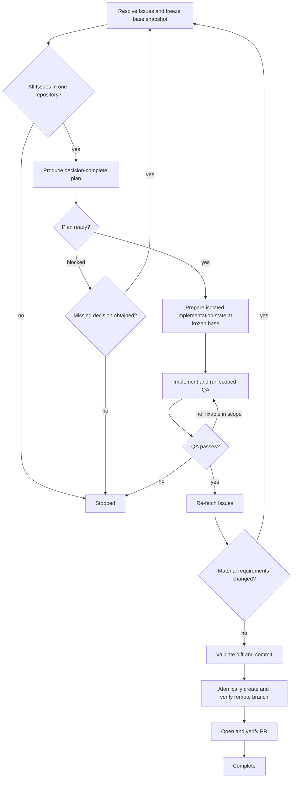

# Issue to PR

Implement one or more same-repository Issues in one pull request. Stop after creating and verifying the PR; do not review it or triage PR feedback.

## Invariants

- Freeze the requested Issue set, repository instructions, target base branch, and exact base SHA before planning.
- Plan and implement against that frozen snapshot. If an Issue changes materially before commit, discard stale work, refresh the snapshot, and plan again.
- Isolate implementation from unrelated work and bind it to the frozen base SHA.
  Choose the edit mechanism supported by the client (such as a worktree,
  checkout, or commit-based API). Keep at most one active writer and changes
  within the accepted plan.
- Before commit, verify the implementation/base binding, final diff, Issue requirements, and required QA.
- Publish only a fresh branch. Create the remote ref atomically only if absent, then verify it points to the intended commit.
- Open a PR for the requested Issues and verify repository, base, head ref, and head SHA.

## Planning

A ready plan must be decision-complete: scope, affected interfaces, implementation decisions, constraints, and verification.

If one material decision is missing, return only:

```text
STATUS: blocked
QUESTION: <smallest missing material decision>
```

## Procedure

1. Resolve all requested Issues and confirm they belong to one repository.
2. Freeze the Issue/base snapshot and produce a valid plan.
3. Prepare an isolated implementation state at the frozen base.
4. Implement the plan and run scoped QA. Fix only failures within scope.
5. Re-fetch the Issues, validate the final diff and QA, then commit.
6. Atomically create and verify the remote branch.
7. Open and re-fetch the PR; finish only when its base/head state matches the intended commit.

## Flow


```mermaid
flowchart TD
  A[Resolve Issues and freeze base snapshot] --> B{All Issues in one repository?}
  B -->|no| X[Stopped]
  B -->|yes| C[Produce decision-complete plan]
  C --> D{Plan ready?}
  D -->|blocked| E{Missing decision obtained?}
  E -->|no| X
  E -->|yes| A
  D -->|yes| F[Prepare isolated implementation state at frozen base]
  F --> G[Implement and run scoped QA]
  G --> H{QA passes?}
  H -->|no, fixable in scope| G
  H -->|no| X
  H -->|yes| I[Re-fetch Issues]
  I --> J{Material requirements changed?}
  J -->|yes| A
  J -->|no| K[Validate diff and commit]
  K --> L[Atomically create and verify remote branch]
  L --> M[Open and verify PR]
  M --> N[Complete]
```

## Result

Return `STATUS: complete | stopped | unsupported`.

On success include the Issues, PR, planned base SHA, PR head SHA, and QA summary. On failure include the blocker or required user decision.
