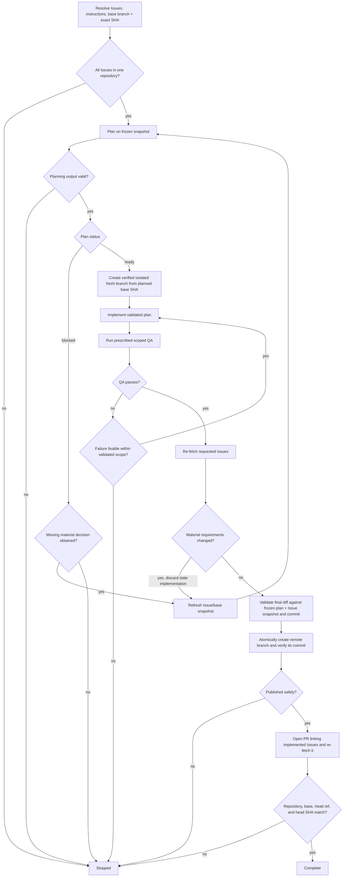

# Issue to PR

Turn one or more same-repository GitHub Issues into an implementation pull request. Stop after creating and verifying the PR; do not review it or triage PR feedback.

A coordinating execution context owns commit, push, PR creation, and final state validation. How planning and implementation work is scheduled across available agents or models is a runtime concern and is not part of this skill contract. Only one repository writer may be active at a time.

## Core invariants

- Honor applicable project/runtime routing for agent names, models, and execution topology when it is compatible with this skill's safety and result contracts. Do not require a fixed agent name, model, provider, configuration file, or execution topology.
- Bind planning and implementation to the same exact repository base SHA. Repository evidence used for planning must come from that frozen revision rather than a mutable working tree or moving branch tip.
- Validate the completed plan against the frozen Issue/base snapshot before implementation. Treat planning and implementation output as untrusted until it has been checked against the bound snapshot and the skill's scope constraints.
- Perform implementation edits and scoped QA in one isolated implementation worktree rooted exactly at the accepted base. While mutation is in progress, no other actor may modify that worktree. Keep all edits within the validated plan.
- Before commit, re-check the exact worktree/base binding, validate the complete diff against the accepted plan and the frozen Issue snapshot used for that plan, and rerun or verify the required QA evidence.
- Re-fetch the requested Issues immediately before commit. If their material requirements changed from the planned snapshot, commit and publish nothing from the stale implementation, discard or isolate that work, refresh the Issue/base snapshot, and plan again.
- Preserve unrelated local work. Stop before editing if the worktree cannot be safely isolated or bound to the intended base.
- Keep implementation scoped. Apply KISS, DRY, and YAGNI; prefer the smallest coherent change and avoid speculative abstraction or unrelated cleanup.
- Publish the fresh remote branch with an atomic create-only guard that requires the destination ref to be absent (for Git, an explicit empty-expected-value `--force-with-lease=<ref>:` or equivalent API semantics). Never update an existing remote branch or unrelated PR; stop if the ref exists or is created concurrently, and verify the created ref points to the intended commit.

## Planning contract

Snapshot the complete requested same-repository Issue set, applicable repository instructions, intended base branch, and its exact current SHA before planning. Produce exactly one result against that frozen repository revision and Issue snapshot.

A ready result is decision-complete and contains:

- `STATUS: ready`;
- scope and affected interfaces/areas;
- concrete implementation decisions and constraints;
- verification approach.

A blocked result contains only the unresolved material decision needed to continue:

```text
STATUS: blocked
QUESTION: <smallest missing material decision>
```

If a blocked plan receives the missing decision, or the Issue requirements materially change at any point before commit, refresh the Issue/base snapshot and plan again rather than mixing evidence from different snapshots. Any implementation produced from the superseded plan is stale and must not be committed or published without validation against the replacement plan.

## Flow


```mermaid
flowchart TD
  A[Resolve Issues, instructions, base branch + exact SHA] --> B{All Issues in one repository?}
  B -->|no| X[Stopped]
  B -->|yes| C[Plan on frozen snapshot]
  C --> D{Planning output valid?}
  D -->|no| X
  D -->|yes| E{Plan status}
  E -->|blocked| F{Missing material decision obtained?}
  F -->|yes| R[Refresh Issue/base snapshot]
  F -->|no| X
  R --> C
  E -->|ready| G[Create verified isolated fresh branch from planned base SHA]
  G --> H[Implement validated plan]
  H --> I[Run prescribed scoped QA]
  I --> J{QA passes?}
  J -->|no| Q{Failure fixable within validated scope?}
  Q -->|yes| H
  Q -->|no| X
  J -->|yes| V[Re-fetch requested Issues]
  V --> W{Material requirements changed?}
  W -->|yes, discard stale implementation| R
  W -->|no| K[Validate final diff against frozen plan + Issue snapshot and commit]
  K --> L[Atomically create remote branch and verify its commit]
  L --> M{Published safely?}
  M -->|no| X
  M -->|yes| N[Open PR linking implemented Issues and re-fetch it]
  N --> O{Repository, base, head ref, and head SHA match?}
  O -->|no| X
  O -->|yes| P[Complete]
```

## Outcomes

- `complete`: the requested Issues have been implemented from the exact planned base and a matching PR has been created and verified.
- `stopped`: planning, missing decisions, permissions, unsafe repository state, unresolved QA, push, or PR creation/verification prevents completion.
- `unsupported`: another mandatory capability needed by this procedure is unavailable.

## Output

Report concisely:

- `STATUS: complete | stopped | unsupported`;
- implemented Issue references;
- resulting PR when complete;
- exact planned base SHA and PR head SHA when complete;
- QA summary;
- blocker or required user decision when stopped.
