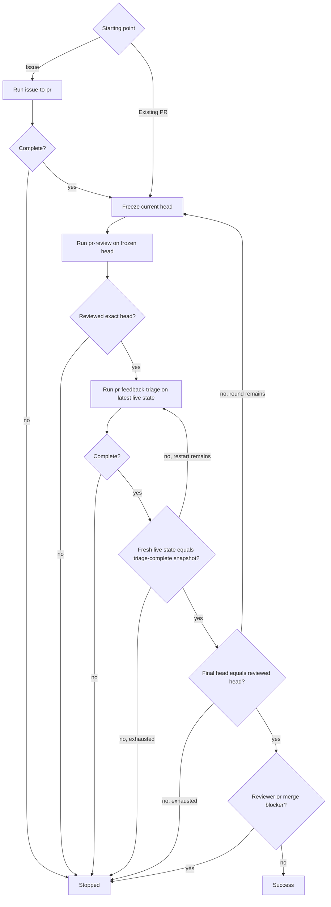

# PR Loop

Drive same-repository Issues into a reviewed pull request, or drive an existing pull request through review and feedback-fix rounds until the final head is reviewed and no actionable or reviewer-blocked state remains.

Compose the sibling [`issue-to-pr`](../issue-to-pr/SKILL.md), [`pr-review`](../pr-review/SKILL.md), and [`pr-feedback-triage`](../pr-feedback-triage/SKILL.md) procedures in the same top-level agent context. Never launch a bundled skill itself as a subagent. Each sibling remains independently runnable and owns its standalone mechanics; composite execution reuses those procedures and their in-context state rather than recreating their policies or serializing state between them.

## Composition invariants

- The top-level agent owns repository and GitHub mutations across the composite run.
- Advance only after the active sibling procedure reaches its documented successful terminal state.
- Bind each `pr-review` invocation to one frozen PR head SHA; an older-head review remains valid historical feedback.
- Run `pr-feedback-triage` against the latest live PR state after each accepted review, even when that state has advanced beyond the reviewed SHA.
- Before success, freshly verify that the live head and complete relevant feedback equal the latest triage-complete snapshot retained in the shared top-level context and that the live head equals the latest reviewed head.

## Phase contracts

- Issue start: run `issue-to-pr` for the complete requested Issue set. Continue only after `STATUS: complete` and a verified resulting PR with exact planned base and PR-head SHAs; otherwise stop.
- Review: freeze the current PR head as `reviewed_target` and run `pr-review` for that exact PR/SHA with publication enabled. Continue only after `STATUS: reviewed` and `REVIEWED_HEAD == reviewed_target`; `reviewed` already implies verified publication for that frozen head.
- Triage: run `pr-feedback-triage` for the same PR against its latest live state with the remaining finite restart budget. Continue only after `STATUS: complete`; retain its exact final head and complete final feedback snapshot directly in the shared top-level context. `awaiting_re_review` remains a parent-level reviewer/merge blocker and must not be cleared by mutating reviewer state.

## Limits

The composite loop requires separate finite review-round and triage-restart budgets supplied by the caller or enforced by the runtime. If either loop has no finite bound, report `unsupported` before entering that loop. Do not infer one budget from the other.

One review round is one frozen-head review followed by triage until the live state matches a triage-complete snapshot. Maintain the triage restart counter in the shared top-level context across triage reinvocations within that round. Every transition from an analyzed or completed triage state back to a fresh triage snapshot consumes one restart, whether detected inside `pr-feedback-triage` or by the parent post-triage check.

## Flow

The post-triage check re-fetches the live PR head and complete relevant paginated feedback and compares them directly with the retained triage-complete snapshot. Same-head feedback divergence returns to triage before any new review; a stable triage result on a different head starts the next review round.

## Outcomes

- `success`: the fresh live state equals the latest triage-complete snapshot, its head equals the latest verified reviewed head, and no parent-level reviewer/merge blocker remains.
- `stopped`: a sibling phase, state validation, permission, exhausted finite budget, or reviewer/merge blocker prevents success.
- `unsupported`: the runtime cannot provide a required bounded execution or sibling procedure reports an unsupported capability.

## Output

Report concisely:

- outcome;
- implemented Issues and resulting PR when applicable;
- review rounds and final reviewed head;
- triage final head and restart usage;
- remaining reviewer/user action or blocker.
