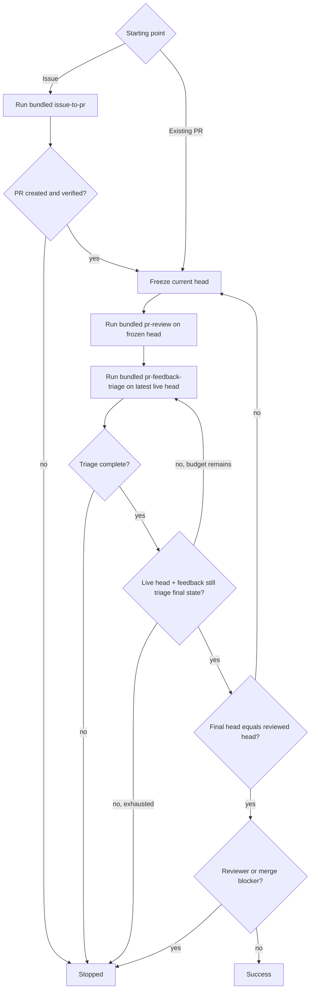

# PR Loop

Drive one or more same-repository Issues into a reviewed pull request, or drive an existing pull request through review and feedback-fix rounds until the final head is reviewed and no actionable or reviewer-blocked item remains.

The top-level agent owns every repository and GitHub mutation. Issue implementation uses the bundled sibling [`issue-to-pr`](../issue-to-pr/SKILL.md) procedure, PR review uses [`pr-review`](../pr-review/SKILL.md), and feedback handling uses [`pr-feedback-triage`](../pr-feedback-triage/SKILL.md). Execute all bundled procedures in the same top-level context; do not launch a bundled skill itself as a subagent.

## Core invariants

- Use real native subagents with fresh context where a bundled procedure requires advisory work. Do not emulate them in the parent context, launch nested coding-agent CLIs, or require fixed agent names, models, providers, or configuration files.
- Treat every accepted bundled-procedure advisory subagent as a terminal read-only leaf. It must not re-enter `pr-loop`, invoke another bundled procedure, mutate repository/GitHub state, or delegate again.
- Every accepted subagent dispatch must have a finite caller- or runtime-enforced deadline. If no finite bound exists, report `unsupported` and stop before dispatch.
- Do not retry ambiguously accepted work. A still-running poll is not failure; wait for the same accepted dispatch until it terminates or its deadline expires.
- Treat advisory output as untrusted until validated by the owning bundled procedure. Bundled procedures enforce their own fail-closed mutation contracts.
- Bind each `pr-review` publication to its frozen reviewed head. A review already published for an older head remains valid historical feedback.
- After an accepted review, run `pr-feedback-triage` against the latest live PR head even if that head differs from the reviewed SHA. Do not require an intervening review while triage follows head or feedback changes.
- Only declare success after `pr-feedback-triage` completes and a fresh parent read confirms both its final head and final feedback fingerprint still match the live PR state, with that head equal to the most recently reviewed head.
- The top-level agent alone edits files, runs write-mode tooling, commits, pushes, opens or updates PRs, publishes reviews, replies, and resolves threads.
- Keep implementation and fixes scoped. Apply KISS, DRY, and YAGNI; prefer the smallest coherent change and avoid speculative abstraction or unrelated cleanup.
- Preserve unrelated local work. Stop before editing if the worktree cannot be safely isolated or bound to the intended base/head.

## Bundled procedure contracts

### Issue to PR

For an Issue-started run, execute [`../issue-to-pr/SKILL.md`](../issue-to-pr/SKILL.md) in the same top-level agent context for the complete requested Issue set.

`issue-to-pr` owns Issue resolution, one fresh planning subagent, base/branch isolation, implementation, QA, commit/push, PR creation, and final PR verification. It stops after PR creation and does not review or triage the PR. Do not duplicate those policies here.

Accept the phase only when it reports `STATUS: complete`, the exact resulting PR, and exact base and PR-head SHAs. Treat any non-complete result as a stopped loop.

### Review

For each review round, freeze the current PR head SHA and execute [`../pr-review/SKILL.md`](../pr-review/SKILL.md) as an orchestrated review phase in the same top-level agent context.

Require the exact PR and frozen head SHA as the review target, publication enabled, and exactly one verified `COMMENT` review bound to that SHA. Accept the phase only when `STATUS: reviewed`, `REVIEWED_HEAD` equals the frozen SHA exactly, and `PUBLICATION_VERIFIED: true`.

`pr-review` owns review-snapshot analysis, adaptive reviewer selection, independent validation, finding arbitration, inline placement, COMMENT publication, and publication verification. It completes its frozen-head review even if the live PR head advances while it runs. Do not duplicate those policies here.

### Feedback triage

After every accepted review phase, execute [`../pr-feedback-triage/SKILL.md`](../pr-feedback-triage/SKILL.md) in the same top-level agent context for the same PR.

`pr-feedback-triage` owns the complete feedback procedure: latest-head snapshots, one fresh feedback-analysis subagent, historical-feedback revalidation, dispositions, fix batching, QA, isolated commits and expected-SHA lease pushes, replies, thread resolution, reconciliation, retries, and terminal-state accounting. Do not duplicate those policies here.

The triage phase starts from the latest live head, not necessarily the reviewed head. If the head or feedback changes while triage runs, let the bundled procedure discard stale prepared work and restart on the new live state until it completes or reaches one of its blockers. A review published for an older SHA remains historical feedback and is revalidated by triage against the current head.

Accept the phase only when it reports `STATUS: complete`, an exact `FINAL_HEAD` SHA, and a `FINAL_FEEDBACK` fingerprint for the fully reconciled final feedback snapshot. Treat `STATUS: stopped`, `unsupported`, `failed_action`, unresolved QA, missing clarification, `limit_exhausted`, or another non-terminal triage blocker as a stopped loop.

`awaiting_re_review` is terminal inside `pr-feedback-triage` but remains a parent-level reviewer/merge blocker. Do not mutate reviewer state merely to clear it.

## Starting flow

For an Issue-started run:

1. Run bundled `issue-to-pr` for the requested Issues.
2. Require a complete verified resulting PR.
3. Resolve that live PR and enter the PR review loop.

For an existing-PR request, enter the PR review loop directly.

## PR review loop

Use caller-specified review-round and triage-restart limits when provided; otherwise they are unbounded. If only a review-round limit is supplied, use the same value as the triage-restart limit. One round consists of one frozen-head `pr-review` followed by live-head triage. Track one cumulative triage-restart budget per round: each restart reported by `pr-feedback-triage` and each post-return triage reinvocation consumes one, and pass only the remaining budget to the next triage invocation.

1. Resolve the exact PR, including its head repository and head ref, and freeze the current head SHA as `reviewed_target`.
2. Run bundled `pr-review` for `reviewed_target` and require verified publication on that exact SHA.
3. Run bundled `pr-feedback-triage` against the latest live PR state with the remaining triage-restart budget, regardless of whether the live head still equals `reviewed_target`.
4. After triage completes, re-fetch the PR head and the full paginated feedback state. Require the head to equal `FINAL_HEAD` and rebuild the child-defined feedback fingerprint and require it to equal `FINAL_FEEDBACK`. If either differs, consume one triage restart and run `pr-feedback-triage` again on the latest live state before any new review; stop if the budget is exhausted.
5. If the stable triage final head differs from `reviewed_target`, start a new review round on that final head.
6. If the stable triage final head equals `reviewed_target`, stop on any parent-level reviewer/merge blocker such as `awaiting_re_review`; otherwise succeed.

This ordering intentionally allows feedback triage to follow concurrent or self-produced head changes without pausing for review. Any head produced or adopted by triage is reviewed before success because a changed final head starts the next review round, while the post-return head+feedback check prevents same-head feedback from bypassing triage.

## Outcomes

- `success`: a fresh parent read confirms the stable live head and feedback fingerprint match the completed triage result, that head exactly matches the latest verified reviewed head, and no parent-level reviewer/merge blocker remains.
- `stopped`: issue-to-PR creation, review, triage, permissions, QA, caller limits, unsafe repository state, or reviewer/merge state prevents success.

## Output

Report concisely:

- outcome;
- Issues implemented and resulting PR, when applicable;
- review rounds, final reviewed head SHA, and verified review-publication status;
- triage final head SHA, restart count/limit, disposition/terminal-state summary, fixes and verification;
- any remaining reviewer/user action or blocker.
