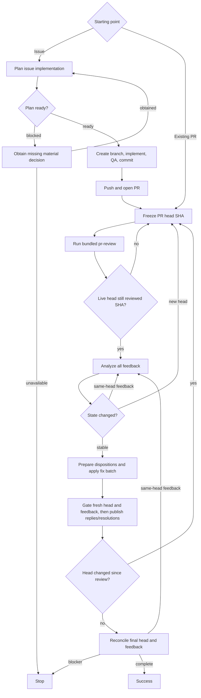

# PR Loop

Drive one or more same-repository Issues into a reviewed pull request, or drive an existing pull request through review and fix rounds until no actionable feedback remains.

The top-level agent owns every repository and GitHub mutation. Planning and feedback analysis use fresh independent read-only native subagents. PR review uses the bundled sibling [`pr-review`](../pr-review/SKILL.md) procedure in the same top-level context; do not launch `pr-review` itself as a subagent.

## Core invariants

- Use real native subagents with fresh context. Do not emulate them in the parent context, launch nested coding-agent CLIs, or require fixed agent names, models, providers, or configuration files.
- Treat every accepted subagent as a terminal leaf. Planning, review discovery, review validation, and feedback analysis must not re-enter `pr-loop`, invoke `pr-review`, or delegate again.
- Every accepted subagent dispatch must have a finite caller- or runtime-enforced deadline. If no finite bound exists, report `unsupported` and stop before dispatch.
- Do not retry ambiguously accepted work. A still-running poll is not failure; wait for the same accepted dispatch until it terminates or its deadline expires.
- If an accepted read-only subagent causes Git-visible mutation, reject its output. Recovery is allowed only when a pre-dispatch snapshot proves exact restoration of HEAD, index, tracked worktree, and non-ignored untracked state; no external side effect occurred; the target head is unchanged; and every advisory sibling that may have observed the mutation is cancelled or reaped and discarded. Restore and redispatch the whole affected advisory set at most once for that head. Otherwise stop.
- Bind each `pr-review` publication to its frozen reviewed head. A review already published for an older head remains valid historical feedback, but if the live head differs after review, do not analyze that review as current or act on its feedback; restart review on the new head first.
- Bind every feedback disposition, fix, reply, and resolution to the exact reviewed head. If the head changes before one of those actions, discard the stale decision and restart review from the new head.
- Treat subagent output as advisory. The top-level agent validates plans, review results, feedback dispositions, repository state, and GitHub state before acting.
- The top-level agent alone edits files, runs write-mode tooling, commits, pushes, opens or updates PRs, publishes reviews, replies, and resolves threads.
- Keep implementation and fixes scoped. Apply KISS, DRY, and YAGNI; prefer the smallest coherent change and avoid speculative abstraction or unrelated cleanup.
- Preserve unrelated local work. Stop before editing if the worktree cannot be safely isolated or bound to the intended base/head.

## Advisory contracts

Give each subagent only the context needed for its role: the user request and settled decisions, exact Issue set or PR head SHA, relevant repository evidence, applicable constraints, and a boundary stating that the subagent is a read-only terminal leaf.

### Planning

For an Issue-started run, dispatch one fresh planning subagent for the complete same-repository Issue set. Require exactly one decision-complete plan with:

- `STATUS: ready` or `STATUS: blocked`;
- scope and affected interfaces/areas;
- concrete implementation decisions and constraints;
- verification approach;
- for `blocked`, only the smallest missing material decision.

### Review

For each recorded PR head SHA, read and execute [`../pr-review/SKILL.md`](../pr-review/SKILL.md) as an orchestrated review phase in the same top-level agent context.

Require:

- the exact PR and recorded head SHA as the frozen review target;
- publication enabled and exactly one verified `COMMENT` review bound to that reviewed SHA;
- fresh direct discovery and validation subagents governed by `pr-review`;
- no nested invocation of `pr-review` as a subagent;
- a composed result with `STATUS`, `REVIEWED_HEAD`, `PUBLISHED_FINDINGS`, `PUBLICATION_VERIFIED`, and `RUN_MARKER`.

Accept the phase only when `STATUS: reviewed`, `REVIEWED_HEAD` equals the recorded head exactly, and `PUBLICATION_VERIFIED: true`. Treat `unsupported` or `failed` as a blocker unless the read-only mutation recovery invariant above applies.

The bundled `pr-review` skill owns review-snapshot analysis and publication. It does not decide whether a newer live PR head requires another review; `pr-loop` owns that decision after `pr-review` returns.

The bundled `pr-review` skill is the source of truth for risk mapping, adaptive reviewer selection, candidate discovery, independent validation, finding arbitration, inline placement, COMMENT publication, and review verification. Do not duplicate those policies here.

### Feedback analysis

After each accepted review phase whose reviewed head is still the live PR head, snapshot every current feedback source and dispatch one fresh feedback-analysis subagent. Preserve source-head provenance whenever GitHub exposes it:

- inline threads/comments: `thread:<id>`, including original/review commit or head metadata when available;
- PR-level comments: `comment:<id>`, with source head recorded when one can be established, otherwise `none`;
- review submissions/bodies: `review:<id>`, including reviewer, persisted state, submission time, reviewed/source head SHA (`commit_id`), and body.

Historical feedback remains in scope. Treat its source head as provenance, not as a reason to discard it: revalidate every historical item against the current reviewed head and classify it from current evidence as `fix`, `already addressed`, `outdated`, or another applicable disposition.

If one artifact contains multiple independent items, decompose them into stable item-scoped IDs while retaining the parent artifact ID. Merge only items with the same root cause.

Require one disposition per distinct item: `fix`, `already addressed`, `outdated`, `answer`, `clarify`, `defer`, or `won't fix`. A `fix` needs a concrete edit and verification plan. `defer` and `won't fix` must state `decision_terminal: true|false`. Include concise reply guidance and whether each source should be resolved, left open, or is not resolvable.

## Issue-started flow

1. Resolve the requested Issues and require them to belong to one repository.
2. Dispatch planning. If blocked, obtain the missing material decision and re-plan; otherwise validate the ready plan.
3. Resolve the intended base branch and exact base SHA. Require a clean isolatable worktree, create a suitable branch from that SHA, and verify the branch starts there.
4. Implement directly in the top-level agent, run repository QA, and commit. Do not delegate implementation.
5. Push the branch and open the PR.
6. Enter the PR review loop.

For an existing-PR request, enter the PR review loop directly.

## PR review loop

Use caller-specified review-attempt and same-head feedback-refresh limits when provided; otherwise they are unbounded. If only a review-attempt limit is supplied, use it for same-head feedback refreshes too. A review attempt begins when the orchestrated `pr-review` phase is invoked for a recorded head SHA. Track same-head refreshes per SHA and reset them when the head changes.

### 1. Freeze the target

Resolve the exact PR, including its head repository and head ref. Record the current head SHA. Every fix commit and push must target that exact head repository/ref, including fork PRs.

Verify that current authentication can read the feedback needed by the loop before spending a review attempt. Use a non-mutating write-permission check when available; otherwise the review publication is the write test.

### 2. Review the exact head

Invoke the bundled `pr-review` procedure for the recorded SHA with publication required. `pr-review` completes and publishes against that frozen SHA even if the live PR head changes while review work is running.

If `pr-review` returns `unsupported` or `failed`, stop unless the read-only mutation recovery invariant applies. If it returns `reviewed`, require `REVIEWED_HEAD` to equal the recorded SHA and require verified publication.

Immediately after an accepted review, re-fetch the live PR head before feedback analysis. If it differs from the reviewed SHA, keep the historical review that was just published, count the attempt, freeze the new live head, and invoke `pr-review` again. Do not analyze, fix, reply to, or resolve feedback from the older head as current work.

Only when the live head still equals the reviewed SHA, initialize `head_changed_since_review` to `false` and continue. Whenever the loop later observes a different head SHA, set the flag to `true` and never clear it for that attempt even if a later fetch returns to the reviewed SHA.

### 3. Analyze all feedback

Snapshot all current feedback sources and dispatch feedback analysis. Treat that snapshot as the baseline for the reviewed head.

After analysis returns, re-fetch the head first. If it changed, discard the analysis and restart review on the new head.

Then re-fetch feedback. If external feedback changed while analysis was running, do not act on stale dispositions. Redispatch feedback analysis on the same head until the snapshot is stable or the applicable refresh limit is reached.

Ignore differences caused only by this loop's own recorded GitHub mutations; any other new or edited thread, comment, review, review state, or feedback content is an external delta.

### 4. Prepare validated dispositions

If the round has any `fix` disposition, bind the local worktree to the exact recorded PR head repository/ref and SHA without discarding unrelated work. Stop if it is dirty, diverged, otherwise unsafe, or lacks required push access.

Initialize `expected_head` to the reviewed head SHA. Batch all fixes from the round into one coherent change against that head, run QA once for the batch, make one commit, and push once. Do not partially publish a conflicting fix batch. After a successful push, re-fetch and replace `expected_head` with the exact resulting head SHA.

For non-fix dispositions, validate and prepare the intended GitHub action without publishing yet:

- `already addressed` / `outdated`: re-validate the evidence against the exact current head and prepare any reply/resolution;
- `answer`: prepare the validated concise answer;
- `clarify`: prepare the question and keep the item open;
- `defer` / `won't fix`: prepare the explanation; resolution is allowed only when `decision_terminal: true` and the source is resolvable.

PR-level comments and review submissions have no thread-resolution action, so their normal terminal state is `not_resolvable` after any applicable reply. Resolve an inline parent thread only when every contributing item is resolve-eligible.

An active unsuperseded `CHANGES_REQUESTED` review is always `awaiting_re_review`. It is superseded only by explicit dismissal or a later review from the same reviewer with state `APPROVED` or `CHANGES_REQUESTED`; a later `COMMENTED` review does not supersede it. Do not mutate reviewer state merely to clear the blocker.

### 5. Gate and publish on fresh state

Before any GitHub reply or resolution, require the PR head to equal `expected_head` exactly. A descendant SHA is not sufficient. If the head differs, publish nothing from the stale analysis and restart review on the new head.

Reconcile the current feedback snapshot with the analysis baseline plus this loop's recorded mutations. If external feedback changed on the same reviewed head, refresh feedback analysis before acting. If feedback arrives after a fix push changed the head, start a new review attempt instead.

Only after both gates pass, publish prepared replies and apply validated terminal actions. Record each successful reply/resolution as this loop's own mutation for later reconciliation. A failed attempted publication, reply, or resolution is `failed_action`.

### 6. Reconcile and continue or finish

Re-fetch the head after acting:

- if `head_changed_since_review` is `true` or the head differs from the reviewed head, start a new review attempt on the current SHA;
- if it is unchanged and the flag is `false`, take one final feedback snapshot and reconcile it against the current baseline plus recorded own mutations;
- if new external feedback exists on the same head, refresh feedback analysis only;
- never invoke another review phase for an unchanged head already carried through this loop.

Finish only when the final head is stable, the required COMMENT review is verified for that exact head, feedback is reconciled, and every feedback item is terminal.

Terminal states are `resolved`, `replied_left_open`, `not_resolvable`, `awaiting_re_review`, or `failed_action`. Completion is blocked by any pending fix publication, `clarify` awaiting input, non-terminal defer/won't-fix, `awaiting_re_review`, `failed_action`, unreconciled head or feedback delta, exhausted caller limits, unsupported required subagent work, unsafe worktree/branch state, authentication/permission failure, or unresolved QA failure.

`replied_left_open` is terminal only when its disposition itself is terminal.

## Outcomes

- `success`: the final reviewed head is stable, required review publication is verified, feedback is reconciled, and no actionable or reviewer-blocked item remains.
- `stopped`: a blocker above prevents success.

## Output

Report concisely:

- outcome;
- Issues implemented and resulting PR, when applicable;
- review attempts, final reviewed head SHA, and verified review-publication status;
- same-head feedback refreshes and any caller limit;
- disposition/terminal-state summary, including `awaiting_re_review` and `not_resolvable`;
- any blocker that stopped the loop.
