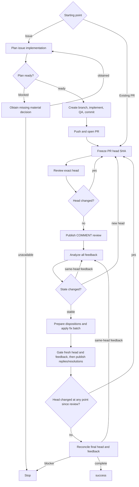

# PR Loop

Drive one or more same-repository Issues into a reviewed pull request, or drive an existing pull request through review and fix rounds until no actionable feedback remains.

The top-level agent owns every repository and GitHub mutation. Delegate only planning, review, and feedback analysis to fresh, independent, read-only subagents through the active runtime's native subagent mechanism.

## Core Invariants

- Use real native subagents with fresh context. Do not emulate them in the parent context, launch nested coding-agent CLIs, or require fixed agent names, models, providers, or configuration files.
- Treat each accepted subagent as a terminal leaf: it performs its assigned role directly and does not re-enter `pr-loop` or delegate again.
- If a required independent subagent cannot be launched, report `unsupported` and stop. Retry only when the runtime proves rejection occurred before execution was accepted, except for the narrowly verified read-only mutation recovery below; never duplicate ambiguously accepted work.
- Every accepted subagent dispatch must be bounded by a finite deadline supplied by the caller or guaranteed by the runtime; the orchestrator need not know a runtime-enforced deadline's concrete value, but must not invent, shorten, or override any bound. If neither source guarantees a finite bound, report the required subagent work as `unsupported` and stop before dispatch. A still-running poll is not failure; keep waiting on the same accepted dispatch until it reaches a terminal result or the deadline expires. On terminal failure or expiry, stop or cancel and reap it without launching replacement work, except for the narrowly verified read-only mutation recovery below.
- If an accepted read-only subagent causes Git-visible mutation, reject its output. Recovery is allowed only when a pre-dispatch state snapshot proves the top-level agent can restore the exact prior HEAD, index, tracked worktree, and non-ignored untracked state; no external publication or other side effect occurred; the target head is unchanged; and every concurrently dispatched advisory sibling that may have observed the mutated checkout is cancelled or reaped and its output discarded. After verifying restoration, redispatch the entire affected advisory set with fresh subagents. Permit this recovery at most once per affected advisory set and target head; if mutation recurs, restoration or side-effect verification fails, or acceptance/effects are ambiguous, stop. This exception does not permit replacement after timeout, ordinary terminal failure, or ambiguous acceptance.
- Bind every review and feedback decision to an exact PR head SHA. If the head changes before an action based on that decision, discard the stale result and restart from the new head.
- Treat subagent output as advisory. The top-level agent validates plans, findings, dispositions, repository state, and GitHub state before acting.
- The top-level agent alone edits files, runs write-mode tooling, commits, pushes, opens or updates PRs, publishes reviews, replies, and resolves threads.
- Keep implementation and fixes scoped. Apply KISS, DRY, and YAGNI; prefer the smallest coherent change and avoid speculative abstraction or unrelated cleanup.
- Preserve unrelated local work. Stop before editing if the worktree cannot be safely isolated or bound to the intended base/head.

## Subagent Contract

Give each subagent only the context needed for its role:

- user request and settled prior decisions;
- exact target: Issue set or PR plus recorded head SHA;
- relevant repository context and governing constraints;
- a delegation boundary stating that the subagent is a read-only terminal leaf;
- role-specific evidence below.

### Planning

For an Issue-started run, dispatch one fresh planning subagent for the complete same-repository Issue set. Require exactly one decision-complete plan with:

- `STATUS: ready` or `STATUS: blocked`;
- scope and affected interfaces/areas;
- concrete implementation decisions and constraints;
- verification approach;
- for `blocked`, only the smallest missing decision needed to proceed.

### Review

For each review attempt, dispatch three fresh subagents against the exact recorded head SHA, one per lens:

- `correctness`;
- `tests/docs`;
- `security/performance`.

Concurrency is optional; independent contexts are mandatory. Give each the changed files and diff for that head. Candidate findings must include lens, severity (`critical`, `high`, `medium`, `low`), confidence, concrete impact, remediation direction, and a file/line anchor when safe.

Subagents return findings only; they never publish them. The top-level agent deduplicates by root cause and drops stale, speculative, style-only, unrelated, or low-confidence findings.

### Feedback Analysis

Dispatch one fresh feedback-analysis subagent after each validated review round. Give it the exact head SHA and every current feedback source:

- inline threads/comments: `thread:<id>`;
- PR-level comments: `comment:<id>`;
- review submissions/bodies: `review:<id>`, including reviewer, persisted state, submission time, and body.

If one artifact contains multiple independent feedback items, decompose them into stable item-scoped IDs while retaining the parent artifact ID. Merge only items with the same root cause.

Require one disposition per distinct feedback item: `fix`, `already addressed`, `outdated`, `answer`, `clarify`, `defer`, or `won't fix`. A `fix` needs a concrete edit and verification plan. `defer` and `won't fix` must state `decision_terminal: true|false`. Include concise reply guidance and whether each source should be resolved, left open, or is not resolvable.

## Issue-Started Flow

1. Resolve the requested Issues and require them to belong to one repository.
2. Dispatch planning. If blocked, obtain the missing material decision and re-plan; otherwise validate the ready plan.
3. Resolve the intended base branch and exact base SHA. Require a clean isolatable worktree, create a suitable branch from that SHA, and verify the branch starts there.
4. Implement directly in the top-level agent, run repository QA, and commit. Do not delegate implementation.
5. Push the branch and open the PR.
6. Enter the PR Review Loop.

For an existing-PR request, enter the PR Review Loop directly.

## PR Review Loop

Use caller-specified review-attempt and same-head feedback-refresh limits when provided; otherwise they are unbounded. If only a review-attempt limit is supplied, use it for same-head feedback refreshes too. A review attempt begins when review subagents are dispatched. A same-head refresh re-runs only feedback analysis and does not consume another review attempt. Track the same-head refresh count per head SHA and reset it whenever the head changes.

### 1. Freeze the target

Resolve the exact PR, including its head repository and head ref. Record the current head SHA. Every fix commit and push must target that exact head repository/ref, including fork PRs.

Verify that current authentication can read the feedback needed by this loop before spending a review attempt. Use a non-mutating write-permission check when the runtime provides one; otherwise the actual review submission is the write test.

### 2. Review the exact head

Dispatch the three review subagents for the recorded head. Initialize an attempt-level `head_changed_since_review` flag to `false`. Whenever the loop observes a head SHA different from the reviewed SHA, including a validated post-fix push, set the flag to `true` and never clear it for that attempt even if a later fetch returns to the reviewed SHA.

If any reviewer violates the read-only mutation contract, discard the entire three-lens round and apply the verified mutation-recovery invariant above before any publication. A recovered redispatch uses three fresh reviewers against the same unchanged head and counts as a new review attempt.

Re-fetch the head when the review subagents finish. If it changed, discard the whole round and restart on the new SHA; the attempt still counts.

Validate and arbitrate the findings. Immediately before publication, re-fetch the head again and discard the round if it moved.

Publish exactly one GitHub review with action `COMMENT` and a non-empty body. Put safely anchorable findings inline and unanchorable findings in the body. If none remain, say only that no new actionable findings were found in this pass; do not imply older feedback is cleared. Re-fetch GitHub state and verify the exact review and intended comments persisted on the reviewed head.

### 3. Analyze all feedback

Snapshot all current feedback sources and dispatch feedback analysis. Treat the snapshot as the analysis baseline for that head.

After analysis returns, re-fetch the head first. If it changed, discard the analysis and restart on the new head.

Then re-fetch the feedback snapshot. If external feedback changed while analysis was running, do not act on stale dispositions. Redispatch feedback analysis on the same head with the fresh snapshot. Continue until the snapshot is stable or the applicable refresh limit is reached.

Ignore differences caused only by this loop's own recorded GitHub mutations; any other new or edited thread, comment, review, review state, or feedback content is an external delta.

### 4. Prepare validated dispositions

If this round has any `fix` disposition, bind the local worktree to the exact recorded PR head repository/ref and SHA without discarding unrelated work. Stop if it is dirty, diverged, otherwise unsafe, or lacks required push access.

Initialize `expected_head` to the reviewed head SHA. Batch all `fix` dispositions from the round into one coherent change against that same head, run QA once for the combined batch, make one commit, and push once. Do not partially publish a conflicting fix batch. After a successful push, re-fetch and replace `expected_head` with the exact resulting head SHA.

For non-fix dispositions, validate and prepare the intended GitHub action, but do not publish, reply, or resolve anything in this step:

- `already addressed` / `outdated`: re-validate the evidence against the exact current head and prepare any reply/resolution.
- `answer`: prepare the validated concise answer.
- `clarify`: prepare the question and keep the item open.
- `defer` / `won't fix`: prepare the explanation; resolution is allowed only when `decision_terminal: true` and the platform source is resolvable.

PR-level comments and review submissions have no thread-resolution action, so their normal terminal state is `not_resolvable` after any applicable reply. Inline parent threads may be resolved only when every feedback item contributing to that thread is resolve-eligible.

An active unsuperseded `CHANGES_REQUESTED` review is always `awaiting_re_review`, regardless of this loop's disposition. It is superseded only by an explicit dismissal or by a later review from the same reviewer with state `APPROVED` or `CHANGES_REQUESTED`; a later `COMMENTED` review does not supersede it. A later `CHANGES_REQUESTED` review transfers the active blocker to that newer review rather than clearing it. This loop must not dismiss or otherwise mutate reviewer state merely to clear the blocker.

### 5. Gate and publish on fresh state

Before any GitHub reply or resolution, require the PR head to equal `expected_head` exactly. A descendant SHA is not sufficient. If the head differs, publish nothing from the stale analysis and restart review on the new head.

Before any GitHub reply or resolution, reconcile the current feedback snapshot with the analysis baseline plus this loop's recorded mutations. If external feedback changed on the same reviewed head, refresh feedback analysis before acting. If feedback arrives after a fix push changed the head, start a new review attempt instead.

Only after both gates pass, publish the prepared replies and apply each validated terminal action: resolve or leave inline threads open conservatively, record PR-level comments and reviews as `not_resolvable` when applicable, and preserve `awaiting_re_review` for active change requests. Record each successful reply/resolution as this loop's own mutation for later reconciliation.

A failed attempted publication, reply, or resolution is `failed_action`.

### 6. Reconcile and continue or finish

Re-fetch the head after acting:

- if `head_changed_since_review` is `true` or the head differs from the reviewed head, start a new review attempt on the current SHA;
- if it is unchanged and the flag is `false`, take one final feedback snapshot and reconcile it against the current baseline plus recorded own mutations;
- if new external feedback exists on the same head, refresh feedback analysis only;
- never dispatch the three review subagents again for an unchanged head already carried through this loop.

Finish only when the final head is stable, the required `COMMENT` review was verified for that head, the feedback snapshot is reconciled, and every feedback item is terminal.

Terminal states are `resolved`, `replied_left_open`, `not_resolvable`, `awaiting_re_review`, or `failed_action`. Completion is blocked by:

- any `fix` still requiring publication;
- `clarify` awaiting input;
- `defer` or `won't fix` with `decision_terminal: false`;
- `awaiting_re_review`;
- `failed_action`;
- an unreconciled head or feedback delta;
- exhausted caller limits;
- unsupported or failed required subagent work after any permitted mutation recovery;
- unsafe worktree/branch state, authentication/permission failure, or unresolved QA failure.

`replied_left_open` is terminal only when its disposition itself is terminal.

## Outcomes

- `success`: the final reviewed head is stable, required review publication is verified, feedback is reconciled, and no actionable or reviewer-blocked item remains.
- `stopped`: a blocker above prevents success.

## Output

Report concisely:

- outcome;
- Issues implemented and resulting PR, when applicable;
- review attempts, final reviewed head SHA, and verified review-publication status;
- same-head feedback refreshes and any caller limit;
- disposition/terminal-state summary, including `awaiting_re_review` and `not_resolvable`;
- any blocker that stopped the loop.
