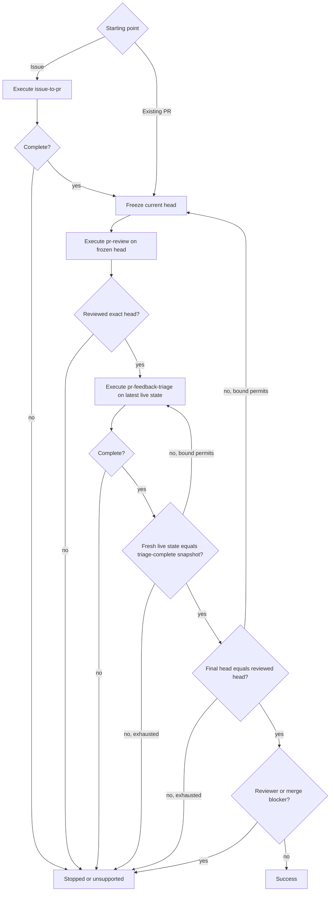

# PR Loop

Drive same-repository Issues into a reviewed pull request, or drive an existing pull request through review and feedback-fix rounds until the final head is reviewed and no actionable or reviewer-blocked state remains.

Compose the sibling [`issue-to-pr`](../issue-to-pr/SKILL.md), [`pr-review`](../pr-review/SKILL.md), and [`pr-feedback-triage`](../pr-feedback-triage/SKILL.md) procedures in one shared orchestration context. Never launch a bundled skill itself as a subagent. Each sibling remains independently runnable, owns its standalone mechanics and safety contract, and may follow compatible project/runtime agent routing internally.

## Composition invariants

- The composite orchestrator owns cross-phase state, phase transitions, and final success validation. Repository/GitHub mutation ownership inside each phase follows that sibling's contract; compatible implementation workers are allowed only where the sibling explicitly permits them and must preserve its single-writer boundary.
- Project/runtime instructions may choose compatible agent names, models, and implementation routing. `pr-loop` must not override those choices merely to impose a fixed topology; it enforces the sibling capability contracts instead.
- Advance only after the active sibling procedure reaches its documented successful terminal state. Propagate `unsupported` when a required sibling or execution bound is unsupported; otherwise stop on non-success.
- Bind each `pr-review` invocation to one frozen PR head SHA; an older-head review remains valid historical feedback.
- Run `pr-feedback-triage` against the latest live PR state after each accepted review, even when that state has advanced beyond the reviewed SHA.
- Before success, freshly verify that the live head and complete relevant feedback equal the latest triage-complete snapshot retained in the shared orchestration context and that the live head equals the latest reviewed head.

## Phase contracts

- Issue start: execute `issue-to-pr` for the complete requested Issue set. Continue only after `STATUS: complete` and a verified resulting PR with exact planned base and PR-head SHAs; otherwise propagate `unsupported` or stop. Any implementation delegation inside that phase must satisfy `issue-to-pr`'s single-writer and orchestrator-validation contract.
- Review: freeze the current PR head as `reviewed_target` and execute `pr-review` for that exact PR/SHA with publication enabled. Continue only after `STATUS: reviewed` and `REVIEWED_HEAD == reviewed_target`; `reviewed` already implies verified publication for that frozen head.
- Triage: execute `pr-feedback-triage` for the same PR against its latest live state under the remaining finite restart bound. Continue only after `STATUS: complete`; retain its exact final head and complete final feedback snapshot directly in the shared orchestration context. Any fix implementation delegation inside that phase must satisfy triage's single-writer and orchestrator-validation contract. `awaiting_re_review` remains a composite reviewer/merge blocker and must not be cleared by mutating reviewer state.

## Limits

The composite loop requires separate finite bounds for review rounds and triage restarts, supplied by the caller or enforced by the runtime. A bound may be an explicit count or an equivalent overall execution deadline/policy that prevents indefinite looping. If either loop is effectively unbounded, report `unsupported` before entering it. Do not infer one bound from the other.

One review round is one frozen-head review followed by triage until the live state matches a triage-complete snapshot. Maintain restart accounting in the shared orchestration context across triage reinvocations within that round. Every transition from an analyzed or completed triage state back to a fresh triage snapshot consumes one restart when a numeric limit is used and remains subject to the equivalent runtime bound otherwise.

## Flow

The post-triage check re-fetches the live PR head and complete relevant paginated feedback and compares them directly with the retained triage-complete snapshot. Same-head feedback divergence returns to triage before any new review; a stable triage result on a different head starts the next review round.

## Outcomes

- `success`: the fresh live state equals the latest triage-complete snapshot, its head equals the latest verified reviewed head, and no composite reviewer/merge blocker remains.
- `stopped`: a sibling phase, state validation, permission, exhausted finite bound, or reviewer/merge blocker prevents success.
- `unsupported`: the runtime cannot provide a required bounded execution or sibling procedure reports an unsupported capability.

## Output

Report concisely:

- outcome;
- implemented Issues and resulting PR when applicable;
- review rounds and final reviewed head;
- triage final head and restart usage;
- remaining reviewer/user action or blocker.
