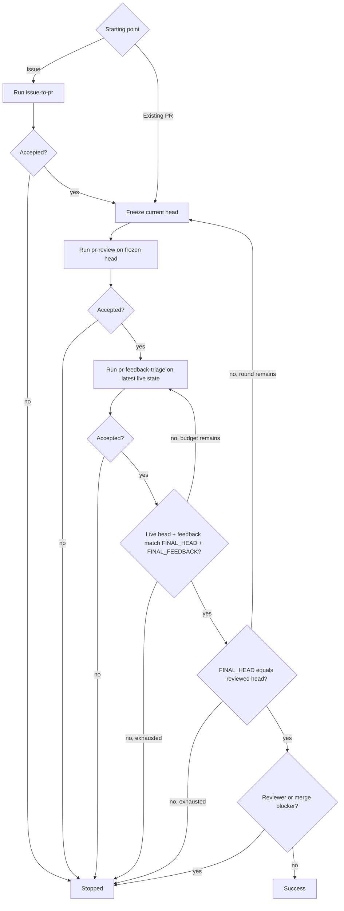

# PR Loop

Drive same-repository Issues into a reviewed pull request, or drive an existing pull request through review and feedback-fix rounds until the final head is reviewed and no actionable or reviewer-blocked state remains.

Compose the sibling [`issue-to-pr`](../issue-to-pr/SKILL.md), [`pr-review`](../pr-review/SKILL.md), and [`pr-feedback-triage`](../pr-feedback-triage/SKILL.md) procedures in the same top-level agent context. Never launch a bundled skill itself as a subagent; each skill owns its internal standalone/composed mechanics.

## Composition invariants

- The top-level agent owns repository and GitHub mutations across the composite run.
- Advance only after validating the invoked skill's terminal contract.
- Bind each `pr-review` invocation to a frozen PR head SHA; an older-head review remains valid historical feedback.
- Run `pr-feedback-triage` against the latest live PR state after each accepted review, even if its head differs from the reviewed SHA.
- Before success, freshly verify that the live head and complete feedback state match the accepted triage result and that the head equals the latest verified reviewed head.

## Phase contracts

- Issue start: run `issue-to-pr` for the complete requested Issue set. Accept only `STATUS: complete` with the exact resulting PR, base SHA, and PR-head SHA; otherwise stop.
- Review: freeze the current PR head as `reviewed_target` and run `pr-review` for that exact PR/SHA with publication enabled. Accept only `STATUS: reviewed`, `REVIEWED_HEAD == reviewed_target`, and `PUBLICATION_VERIFIED: true`; otherwise stop.
- Triage: run `pr-feedback-triage` for the same PR against its latest live state with the remaining restart budget. Accept only `STATUS: complete` with exact `FINAL_HEAD`, `FINAL_FEEDBACK`, and integer `RESTARTS`; otherwise stop. `awaiting_re_review` remains a parent-level reviewer/merge blocker and must not be cleared by mutating reviewer state.

## Limits

Use caller-specified review-round and triage-restart limits when provided; otherwise they are unbounded. If only a review-round limit is supplied, use the same value as the triage-restart limit.

One review round is one frozen-head review followed by live-head triage. Track a cumulative triage-restart budget per round: child-reported `RESTARTS` and each parent-triggered triage reinvocation both consume it. Pass only the remaining budget to the next triage invocation.

## Flow

For the post-triage check, re-fetch the live PR head and complete paginated feedback, rebuild the child-defined feedback fingerprint, and compare it with `FINAL_FEEDBACK`. Same-head feedback divergence returns to triage before any new review, subject to the restart budget.

## Outcomes

- `success`: the stable live head and feedback match the accepted triage result, that head equals the latest verified reviewed head, and no parent-level reviewer/merge blocker remains.
- `stopped`: a bundled phase, state validation, caller limit, permission, or reviewer/merge blocker prevents success.

## Output

Report concisely:

- outcome;
- implemented Issues and resulting PR when applicable;
- review rounds and final reviewed head;
- triage final head and restart usage;
- remaining reviewer/user action or blocker.
