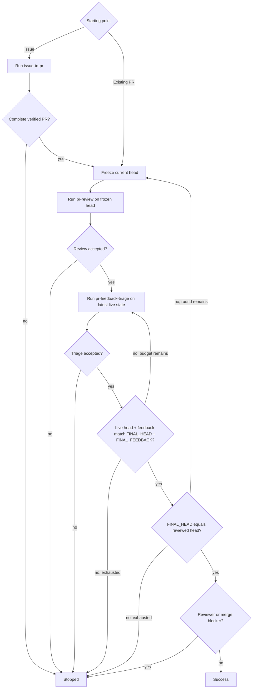

# PR Loop

Drive one or more same-repository Issues into a reviewed pull request, or drive an existing pull request through review and feedback-fix rounds until the final head is reviewed and no actionable or reviewer-blocked item remains.

Compose the bundled sibling [`issue-to-pr`](../issue-to-pr/SKILL.md), [`pr-review`](../pr-review/SKILL.md), and [`pr-feedback-triage`](../pr-feedback-triage/SKILL.md) procedures. Execute them in the same top-level agent context; do not launch a bundled skill itself as a subagent. Each bundled procedure owns its internal policy and mechanics.

## Composition invariants

- The top-level agent owns repository and GitHub mutations across the composite run.
- Validate each bundled procedure's terminal contract before advancing; treat any non-accepted result as stopped.
- Bind each `pr-review` to a frozen PR head SHA. A review published for an older head remains historical feedback.
- After each accepted review, run `pr-feedback-triage` against the latest live PR state, even if its head differs from the reviewed SHA.
- Before success, re-fetch the live PR head and complete feedback state and require them to match the accepted triage final state, with that head equal to the most recently reviewed head.

## Bundled procedure contracts

### Issue to PR

For an Issue-started run, execute [`../issue-to-pr/SKILL.md`](../issue-to-pr/SKILL.md) for the complete requested Issue set.

Accept only `STATUS: complete` with the exact resulting PR, base SHA, and PR-head SHA. Continue with that PR; otherwise stop.

### Review

Freeze the current PR head SHA as `reviewed_target`, then execute [`../pr-review/SKILL.md`](../pr-review/SKILL.md) for that exact PR and SHA with publication enabled.

Accept only `STATUS: reviewed` with `REVIEWED_HEAD == reviewed_target` and `PUBLICATION_VERIFIED: true`. Otherwise stop.

### Feedback triage

After an accepted review, execute [`../pr-feedback-triage/SKILL.md`](../pr-feedback-triage/SKILL.md) for the same PR against its latest live state.

Accept only `STATUS: complete` with exact `FINAL_HEAD` and `FINAL_FEEDBACK`. `awaiting_re_review` remains a parent-level reviewer/merge blocker. Any other non-complete result stops the loop.

## Limits

Use caller-specified review-round and triage-restart limits when provided; otherwise they are unbounded. If only a review-round limit is supplied, use the same value as the triage-restart limit.

One review round is one frozen-head `pr-review` followed by live-head triage. Track one cumulative triage-restart budget per round: child-reported restarts and parent-triggered reinvocations both consume it, and pass only the remaining budget to the next triage invocation.

## Flow

When validating the triage result, rebuild its child-defined feedback fingerprint from the freshly fetched complete feedback state. Do not start a new review while the same-head live state has diverged from the accepted triage result; re-run triage first, subject to its restart budget.

## Outcomes

- `success`: the stable live head and feedback match the accepted triage result, that head equals the latest verified reviewed head, and no parent-level reviewer/merge blocker remains.
- `stopped`: a bundled phase, state validation, caller limit, permission, or reviewer/merge blocker prevents success.

## Output

Report concisely:

- outcome;
- implemented Issues and resulting PR when applicable;
- review rounds and final reviewed head;
- triage final head, restart usage, and terminal summary;
- remaining reviewer/user action or blocker.
