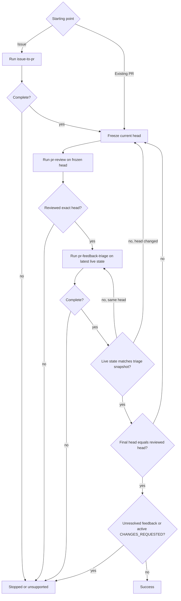

# PR Loop

Compose [`issue-to-pr`](../issue-to-pr/SKILL.md), [`pr-review`](../pr-review/SKILL.md), and [`pr-feedback-triage`](../pr-feedback-triage/SKILL.md) until the stable final PR head is reviewed and all observed feedback is triaged.

Each sibling owns its standalone mechanics and safety contract.

## Procedure

1. For an Issue start, run `issue-to-pr` for the complete requested Issue set and continue only after `STATUS: complete` with a verified PR.
2. Freeze the current PR head as `reviewed_target`.
3. Run `pr-review` for that exact SHA with publication enabled. Continue only after `STATUS: reviewed` and `REVIEWED_HEAD == reviewed_target`.
4. Run `pr-feedback-triage` against the latest live PR state and retain its exact final head and feedback snapshot. Continue only after `STATUS: complete`.
5. Re-fetch the live head and complete feedback:
   - if feedback changed while the head stayed the same, triage again;
   - if the head changed, start another review round;
   - if state matches the retained triage snapshot and the head equals the latest reviewed head, continue.
6. Succeed if the final head is reviewed and all published actionable feedback in the stable snapshot is reconciled. Stop for an active `CHANGES_REQUESTED` review or unresolved actionable feedback.

Do not wait or poll for pending, running, or requested third-party reviews (including bots). Triage third-party feedback already published at the final snapshot, including comments on older heads, against the latest head. Feedback published after the final snapshot is for a later run.

Treat CI failures, branch-protection requirements, mergeability, and deployment/acceptance checks as merge-readiness findings, not `pr-loop` completion blockers. Report them without bypassing protections, attempting an unauthorized merge, or claiming the PR or its Issue is complete.

Do not clear reviewer state merely to satisfy the loop.

## Flow

```mermaid
flowchart TD
  S{Starting point} -->|Issue| I[Run issue-to-pr]
  S -->|Existing PR| A[Freeze current head]
  I --> J{Complete?}
  J -->|no| X[Stopped or unsupported]
  J -->|yes| A
  A --> B[Run pr-review on frozen head]
  B --> C{Reviewed exact head?}
  C -->|no| X
  C -->|yes| D[Run pr-feedback-triage on latest live state]
  D --> E{Complete?}
  E -->|no| X
  E -->|yes| F{Live state matches triage snapshot?}
  F -->|no, same head| D
  F -->|no, head changed| A
  F -->|yes| G{Final head equals reviewed head?}
  G -->|no| A
  G -->|yes| H{Unresolved feedback or active CHANGES_REQUESTED?}
  H -->|yes| X
  H -->|no| Y[Success]
```

## Bounds

Keep review-round and triage-restart limits separate. Caller/runtime values override defaults.

- review rounds: default maximum 3;
- triage restarts: use `pr-feedback-triage`'s default maximum 9.

If an applicable bound is exhausted, stop. If a required finite bound or mandatory operation cannot be provided, return `unsupported`.

## Result

- `success`: live head/feedback equal the latest triage-complete snapshot, live head equals the latest reviewed head, and no unresolved actionable feedback or active `CHANGES_REQUESTED` review remains. This does not imply the PR is mergeable or the Issue is closed.
- `stopped`: a phase, state check, permission, exhausted bound, unresolved actionable feedback, or active `CHANGES_REQUESTED` review prevents success.
- `unsupported`: a required capability/resource or finite bound is unavailable.

Report the outcome, resulting PR/Issues when applicable, review rounds and final reviewed head, triage final head/restarts, any feedback blocker, and outstanding CI, merge, or deployment/acceptance requirements separately.
