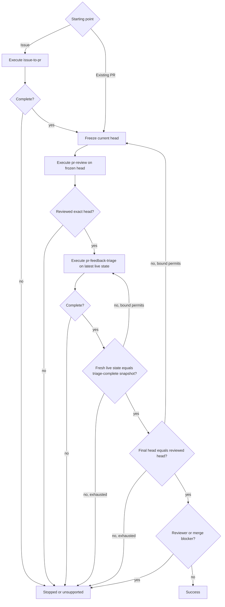

# PR Loop

Drive same-repository Issues into a reviewed pull request, or drive an existing pull request through review and feedback-fix rounds until the final head is reviewed and no actionable or reviewer-blocked state remains.

Compose the sibling [`issue-to-pr`](../issue-to-pr/SKILL.md), [`pr-review`](../pr-review/SKILL.md), and [`pr-feedback-triage`](../pr-feedback-triage/SKILL.md) procedures in one shared orchestration context. Each sibling remains independently runnable and owns its standalone mechanics and safety contract.

Sibling procedures and their support files are semantic dependencies, not registry dependencies. Prefer the runtime's registered skill interface when available, otherwise resolve the sibling `SKILL.md` and support files through ordinary repository/file access. Never stop merely because a sibling or a `references/` file is absent from a host registry.

Execution topology is intentionally unspecified. The active runtime, agent, and model decide how each phase is executed while preserving the sibling procedures' state, mutation, validation, and result contracts.

## Composition invariants

- The composite execution context owns cross-phase state, phase transitions, and final success validation. Repository/GitHub mutation rules inside each phase follow that sibling's contract.
- Project/runtime instructions may choose compatible agent names, models, and execution routing. `pr-loop` does not impose a fixed execution topology.
- Advance only after the active sibling procedure reaches its documented successful terminal state. A missing skill/support-file registry entry is recoverable when the resource remains accessible through ordinary file access. Propagate `unsupported` when a sibling reports a genuine capability/resource failure, a mandatory operation is unavailable, or an effective finite bound cannot be enforced; otherwise stop on non-success.
- Bind each `pr-review` invocation to one frozen PR head SHA; an older-head review remains valid historical feedback.
- Run `pr-feedback-triage` against the latest live PR state after each accepted review, even when that state has advanced beyond the reviewed SHA.
- Before success, freshly verify that the live head and complete relevant feedback equal the latest triage-complete snapshot retained in the shared orchestration context and that the live head equals the latest reviewed head.

## Phase contracts

- Issue start: execute `issue-to-pr` for the complete requested Issue set. Continue only after `STATUS: complete` and a verified resulting PR with exact planned base and PR-head SHAs; otherwise propagate `unsupported` or stop.
- Review: freeze the current PR head as `reviewed_target` and execute `pr-review` for that exact PR/SHA with publication enabled. Continue only after `STATUS: reviewed` and `REVIEWED_HEAD == reviewed_target`; `reviewed` already implies verified publication for that frozen head.
- Triage: execute `pr-feedback-triage` for the same PR against its latest live state under the remaining finite restart bound. Continue only after `STATUS: complete`; retain its exact final head and complete final feedback snapshot directly in the shared orchestration context. If fixes were already applied before formal triage, do not stop solely for that procedural deviation: take a fresh live snapshot, re-triage every feedback item, validate the current diff/state, and continue from that new snapshot. `awaiting_re_review` remains a composite reviewer/merge blocker and must not be cleared by mutating reviewer state.

## Limits

The composite loop keeps separate finite bounds for review rounds and triage restarts. Caller/runtime bounds override portable defaults independently. When no caller/runtime review-round bound is supplied, allow at most 3 review rounds. For triage restarts, when no caller/runtime bound is supplied, use the sibling `pr-feedback-triage` portable default of 9 actual restarts after the initial snapshot. If the runtime cannot enforce an effective finite bound, report `unsupported` before entering the affected loop. Do not infer one bound from the other.

One review round is one frozen-head review followed by triage until the live state matches a triage-complete snapshot. Maintain restart accounting in the shared orchestration context across triage reinvocations within that round. Every transition from an analyzed or completed triage state back to a fresh triage snapshot consumes one restart when a numeric limit is used and remains subject to the equivalent runtime bound otherwise.

## Flow

```mermaid
flowchart TD
  S{Starting point} -->|Issue| I[Execute issue-to-pr]
  S -->|Existing PR| A[Freeze current head]
  I --> J{Complete?}
  J -->|no| X[Stopped or unsupported]
  J -->|yes| A
  A --> B[Execute pr-review on frozen head]
  B --> C{Reviewed exact head?}
  C -->|no| X
  C -->|yes| D[Execute pr-feedback-triage on latest live state]
  D --> E{Complete?}
  E -->|no| X
  E -->|yes| F{Fresh live state equals triage-complete snapshot?}
  F -->|no, bound permits| D
  F -->|no, exhausted| X
  F -->|yes| G{Final head equals reviewed head?}
  G -->|no, bound permits| A
  G -->|no, exhausted| X
  G -->|yes| H{Reviewer or merge blocker?}
  H -->|yes| X
  H -->|no| Y[Success]
```

The post-triage check re-fetches the live PR head and complete relevant paginated feedback and compares them directly with the retained triage-complete snapshot. Same-head feedback divergence returns to triage before any new review; a stable triage result on a different head starts the next review round.

## Outcomes

- `success`: the fresh live state equals the latest triage-complete snapshot, its head equals the latest verified reviewed head, and no composite reviewer/merge blocker remains.
- `stopped`: a sibling phase, state validation, permission, exhausted finite bound, or reviewer/merge blocker prevents success.
- `unsupported`: a sibling's required capability or bundled resource is genuinely unavailable, a mandatory repository/GitHub operation is unavailable, or an effective finite bound cannot be enforced. Skill/support-file registry absence alone is recovered through ordinary file access when the resource remains accessible.

## Output

Report concisely:

- outcome;
- implemented Issues and resulting PR when applicable;
- review rounds and final reviewed head;
- triage final head and restart usage;
- remaining reviewer/user action or blocker.
