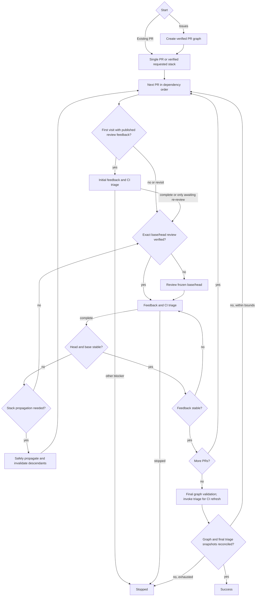

# PR Loop

Compose [`issue-to-pr`](../issue-to-pr/SKILL.md), [`pr-review`](../pr-review/SKILL.md), and [`pr-feedback-triage`](../pr-feedback-triage/SKILL.md). Each skill owns its standalone mechanics and safety checks; do not duplicate its review, feedback, or CI assessment. Work bottom-up through dependent PRs and separately through independent PRs.

Keep an explicit PR dependency graph, entry phase (`review` or `triage`), and phase (`review`, `triage`, `reconcile`, `done`) per PR. State the start mode and identifiers before the first tool call; report the verified graph and phase/restart changes as work proceeds. Run every required phase without asking for intermediate confirmation. Do not add unrelated changes, merge PRs, clear reviewer state, or wait for third-party reviews or unrelated CI. Delegated triage may wait only for checks selected for remediation after publishing a fix.

## Procedure

1. **Resolve graph.** For Issues, run `issue-to-pr` on the complete Issue set and require its verified `STATUS: complete` PR graph. For an existing PR, process only that PR unless a requested stack's membership is verified.
2. **Choose entry phase.** On each PR's first visit, read all pages of submitted reviews and inline review comments. If any published review or inline feedback exists (including on older heads), start at step 4 (**Triage**); otherwise start at step 3 (**Review**). Pending reviews and review requests do not count. Make this choice only once per PR; subsequent restarts follow reconciliation, not the entry check.
3. **Review.** In dependency order, freeze each PR's base ref/SHA, head SHA, and published feedback. Reuse a published `pr-review` only after independently verifying its trusted author and execution provenance, then matching its persisted `COMMENT` review, commit-bound head SHA, run marker, and explicit reviewed-base SHA marker to the frozen pair. Establish trusted author identity from authenticated runtime or verified workflow metadata, never from user-controlled PR text or markers; for workflow-produced reviews verify the corresponding successful review run for that PR and snapshot. GitHub reviews without trustworthy provenance or exact-pair evidence cannot be reused. Otherwise run `pr-review` with publication enabled; require `STATUS: reviewed`, `REVIEWED_HEAD` equal to the frozen head, and an unchanged live base/head after publication. Reused reviews do not consume a review round.
4. **Triage.** Run `pr-feedback-triage` on the live PR, including completed head and validated test-merge CI failures. Require `STATUS: complete`, including terminal outcomes for all selected CI-remediation targets, except on the initial triage-first pass: `STATUS: stopped` may proceed to step 3 **only** if `awaiting_re_review` is the sole remaining blocker and every fix, reply, resolution, required QA, completed CI failure assessment, and selected-CI verification/abandonment is verified. Preserve that approval blocker; never treat the exception as completion or bypass a later triage stop. Retain the final head, feedback snapshot, and CI report (including per-target remediation outcomes), not the private CI assessment ledger. For dependent PRs, verify the base SHA before triage and again before every triage mutation; if its parent moved, propagate and re-review. If a pre-mutation base check is unavailable, return `unsupported`. After entry triage, apply step 3 to its resulting live base/head, reusing a verified exact-pair review when available; then run normal triage and reconciliation. Keep triage's history and budgets across all invocations.
5. **Reconcile.** Re-fetch base/head and all feedback. If either SHA moved, invalidate the review, propagate affected stack changes (step 6), and review again. If only feedback changed, triage again. Otherwise require the latest reviewed base/head to equal the stable triage snapshot.
6. **Propagate stack changes.** After a lower layer's head changes, update descendants in order via a supported safe stack sync/rebase or explicit expected-SHA updates. Recheck each descendant's base/head, parent-relative diff, and QA; invalidate its previous review. Never silently force-push. Stop on conflicts, unexpected heads, or unavailable safe propagation.
7. **Final pass.** Re-fetch the entire graph. For each stable reviewed base/head pair, invoke triage once more to refresh final feedback and CI assessment, and verify or explicitly abandon any affected selected checks on the final head under its existing history and remediation budget, then repeat step 5. Restart at the first invalidated PR when needed, within the bounds below. Complete only after all graph edges, review snapshots, final feedback, and assessed completed CI failures reconcile.

Do not poll requested reviews or unrelated pending/running checks. Delegated `pr-feedback-triage` polls only selected checks following a published CI fix, within its per-head verification bound. Triage published feedback, including comments on old heads, against the latest head. Treat feedback arriving after the final snapshot as next-run work. CI changes alone do not require re-review; new head/base or feedback does. A completed CI failure is a triage remediation candidate, not merely a merge-readiness warning.

## Flow

```mermaid
flowchart TD
  S{Start} -->|Issues| I[Create verified PR graph]
  S -->|Existing PR| A[Single PR or verified requested stack]
  I --> A
  A --> B[Next PR in dependency order]
  B --> Q{First visit with published review feedback?}
  Q -->|yes| T[Initial feedback and CI triage]
  Q -->|no or revisit| C{Exact base/head review verified?}
  T -->|complete or only awaiting re-review| C
  T -->|other blocker| X[Stopped]
  C -->|no| R[Review frozen base/head]
  C -->|yes| D[Feedback and CI triage]
  R --> D
  D -->|complete| E{Head and base stable?}
  D -->|stopped| X
  E -->|no| F{Stack propagation needed?}
  F -->|yes| G[Safely propagate and invalidate descendants]
  G --> B
  F -->|no| C
  E -->|yes| K{Feedback stable?}
  K -->|no| D
  K -->|yes| H{More PRs?}
  H -->|yes| B
  H -->|no| V[Final graph validation; invoke triage for CI refresh]
  V --> J{Graph and final triage snapshots reconciled?}
  J -->|no, within bounds| B
  J -->|no, exhausted| X[Stopped]
  J -->|yes| Y[Success]
```

## Bounds and stopping

Caller/runtime limits override these independent defaults:

- Reviews: at most **3 rounds per PR**, including reviews invalidated by base changes.
- Triage: at most **9 state-change restarts per PR**, retained across invocations; triage separately owns **3 CI-related fix/push cycles per PR** across the overall run and **15 minutes of selected-CI verification per published fix/head** (or tighter runtime bounds).
- Multi-PR graph reconciliation: at most **3 full-graph passes**, including passes after propagation.

Stop when a required phase cannot complete, a review/state-change/graph-reconciliation bound is exhausted, a remote state change cannot be reconciled safely, feedback remains actionable, or an active `CHANGES_REQUESTED` review persists. Exhausting a CI fix/wait bound instead ends affected selected targets as `abandoned` with explicit reasons, not a stop condition by itself. Return `unsupported` when a mandatory capability or finite bound is unavailable. Open PRs and unselected pending/failed/unknown CI alone do not preclude successful reconciliation. Selected CI must have a terminal `verified_passed` or explicitly `abandoned` outcome, and abandonment must be reported. Success does **not** imply all CI passed, merge readiness, closed Issues, or permission to merge.

## Result

Return `success | stopped | unsupported` and the mode, ordered Issue/PR graph, each PR's entry phase, per-PR reviewed base/head SHAs, review rounds, final triage heads/restarts, propagation attempts, feedback blockers, CI status, selected-check verification/abandonment outcomes and evidence URLs, CI fix counts, and outstanding branch-protection, mergeability, deployment, and acceptance requirements. Preserve legacy single-PR fields for a single-PR run. Use triage's final CI observation boundary rather than maintaining a second CI ledger.
